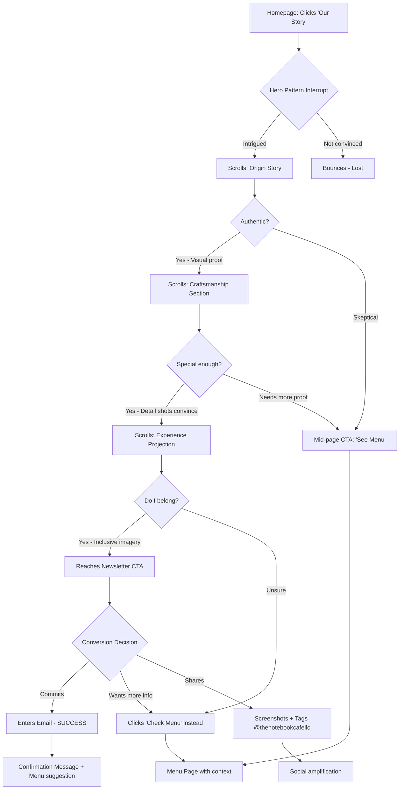
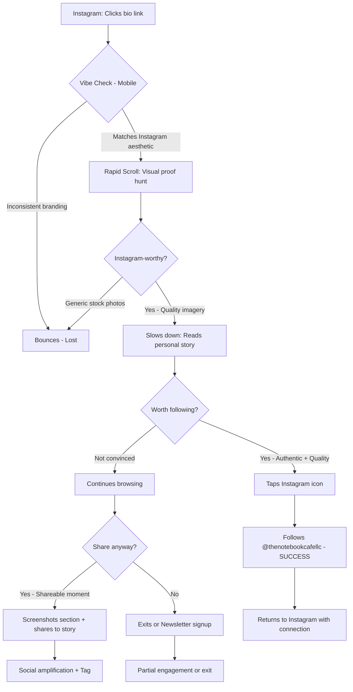
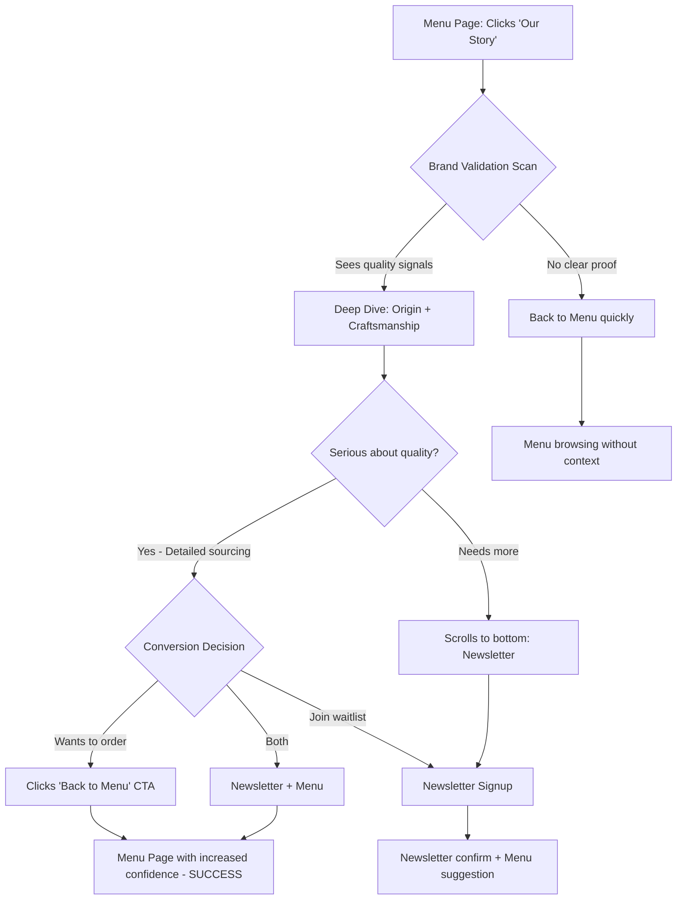
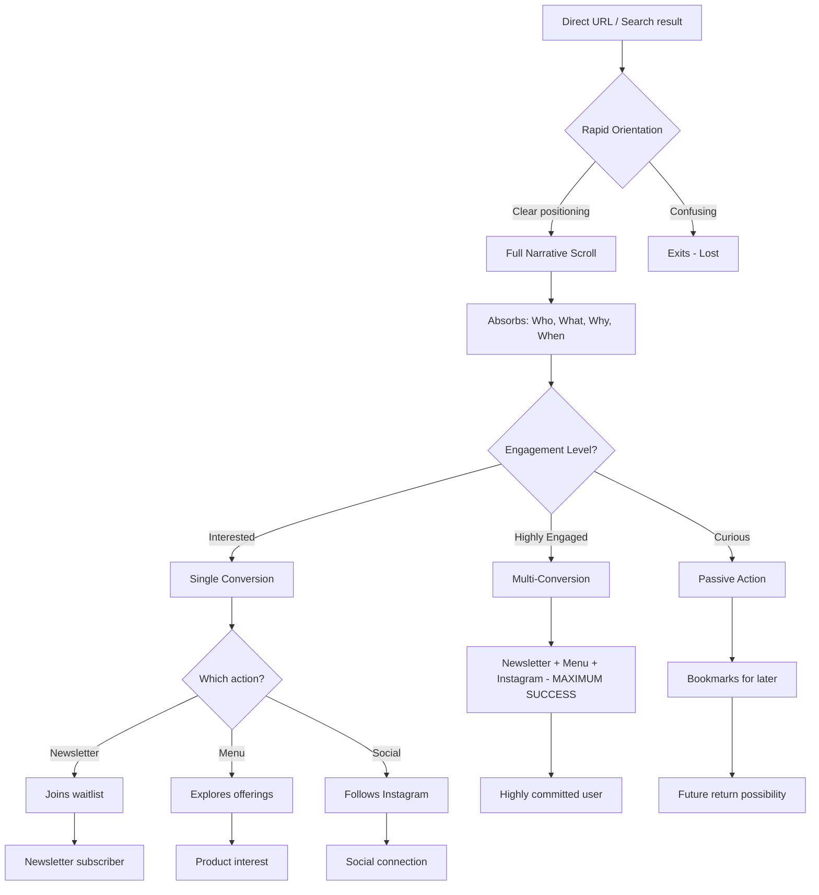

# UX Design Specification thenotebook-cafe

**Author:** Jose
**Date:** 2025-12-23

**Implementation Note:** The Story Page described here is implemented in `app/story/page.tsx` with matching section layout, typography, and scroll reveal effects.

**Implementation Adjustments:** The live build uses `Reveal`/`RevealText`/`FadeInSection` for scroll animations, and decorative accents are implemented inline with icons/CSS rather than dedicated floating-item components.

---

<!-- UX design content will be appended sequentially through collaborative workflow steps -->

## Executive Summary

### Project Vision

The Notebook Café Story Page is the digital embodiment of Riverside's first truly genuine coffee community hub—a place where craft meets comfort, where all walks of life converge, and where the website aesthetic authentically mirrors the physical space. This isn't another generic coffee shop site; it's a thoughtfully designed experience that breaks the boring franchise mold and invites users into a warm, modern, cozy narrative.

The page serves as the emotional payoff to the homepage's anticipation, revealing the full story of a husband-wife team building their first business together—every bench, table, and detail custom-designed with intention. Located in the heart of Riverside's art district near University Drive nightlife and the courthouse, The Notebook Café bridges communities: the remote worker seeking a cozy workspace, the art enthusiast exploring the district, the pre-club crew, and courthouse professionals all find their home here.

Success means visitors finish scrolling and think: **"This is genuine. This is thoughtful. This is MY kind of spot. I want to hang out here."** Then they follow @thenotebookcafellc, join the newsletter, and convert curiosity into commitment.

### Target Users

**Primary Audience: Riverside Locals Seeking Authentic Connection**

- **Remote workers & freelancers** looking for a cozy, well-designed workspace (not a franchise)
- **Art district visitors** exploring Riverside's creative scene
- **Social/nightlife crowd** near University Drive clubs seeking pre/post-hangout spots
- **Courthouse professionals** wanting a warm alternative to corporate chains
- **Design enthusiasts** who appreciate custom-crafted aesthetics and thoughtful details
- **Community supporters** excited to back local, husband-wife owned businesses

**User Psychographics:**
- Values authenticity over franchise convenience
- Craves cozy, inviting spaces over "in-and-out" efficiency
- Appreciates craft, design, and intentional details
- Seeks "all walks of life welcome" inclusivity
- Wants to be part of something genuine, not generic
- Mobile-first (Instagram-native, shares aesthetically pleasing experiences)

**Emotional Context:**
Users arrive excited about supporting local and curious about "the new spot." They're tired of boring, generic coffee experiences and skeptical that another shop will be different. They're seeking a place that feels warm, modern, inviting, and REAL—a space where the website vibe matches the physical vibe perfectly.

### Key Design Challenges

1. **Breaking Coffee Shop Website Clichés**
   - Most coffee sites are templated, boring, generic
   - Users have low expectations: "probably just another basic site"
   - Challenge: Create immediate visual differentiation that signals thoughtfulness and craft
   - Solution space: Bold aesthetic choices, distinctive typography, unexpected layouts, warmth that feels authentic not manufactured

2. **Proving Genuineness Through Digital Experience**
   - Users are skeptical of "we're different" claims from every coffee shop
   - Generic content doesn't convince anyone anymore
   - Challenge: Show, don't tell—use visual storytelling and design quality to prove the care
   - Solution space: Showcase custom-designed furniture details, warm photography, cohesive aesthetic matching physical space, authentic narrative voice

3. **Serving Diverse Communities with Unified Inviting Vibe**
   - Target spans remote workers, art crowd, nightlife visitors, professionals—all walks of life
   - Challenge: Feel cozy (not stuffy), modern (not cold), inclusive (not generic)
   - Solution space: Flexible visual language, welcoming copy tone, community-connected imagery, "you belong here" messaging regardless of who you are

4. **Matching Site Aesthetic to Physical Space**
   - The custom-designed benches, tables, and details have a specific aesthetic (crafted, warm, modern)
   - If the site feels disconnected from the space, trust breaks
   - Challenge: Create digital design language that authentically reflects the physical vibe
   - Solution space: Design system that mirrors café's warmth, materials, textures, lighting

### Design Opportunities

1. **Leverage Frontend-Design Skill for Truly Distinctive Aesthetic**
   - Break free from coffee shop web conventions (beige minimalism, generic latte art, predictable layouts)
   - Create bold, memorable typography choices (not Inter/Roboto/generic sans)
   - Unexpected visual compositions that feel crafted, not templated
   - Match the custom furniture aesthetic: thoughtful, detailed, warm-modern fusion

2. **Position as Community Anchor in Riverside's Creative/Social Scene**
   - Highlight art district location and University Drive nightlife proximity
   - Showcase dual nature: productive workspace by day, social hub by night
   - Visual storytelling around "all walks of life welcome here"
   - Connect to Riverside's cultural fabric, not just "another coffee vendor"

3. **Create Shareable Instagram-Worthy Authenticity**
   - Every section designed for natural shareability (not forced/staged)
   - Beauty emerges from craft, design quality, genuine warmth—not manufactured perfection
   - Encourage @thenotebookcafellc follows by showing there's a story worth following
   - Make the site itself an extension of the Instagram-worthy physical space

4. **Establish "Thoughtful Design = Quality Experience" Association**
   - If the website is this well-designed and intentional, the café must be too
   - Use site quality as proof of overall attention to detail and care
   - Create trust through design excellence before they ever visit
   - Premium feel without being pretentious or exclusive

## 2. Core User Experience

### 2.1 Defining Experience

**Core Interaction:** "Scroll to feel the vibe before you visit."

The Story Page delivers a **scroll-driven progressive revelation** where users transform curiosity into conviction without needing to click, hunt, or navigate. The story unfolds naturally through smooth scrolling, building desire with each section reveal.

**The Defining Loop:**
1. **Land** → Pattern interrupt in hero (Ken Burns slideshow + bold typography) signals "this is different"
2. **Scroll** → Each section reveals quality story: Mexican coffee sourcing (beans, origin, cultural connection), custom-designed furniture, thoughtful brewing process
3. **Imagine** → Aesthetic images with intentional negative space create "I could be there" moments (doing homework, taking photos, enjoying coffee)
4. **Act** → Clear path to menu, newsletter (@thenotebookcafellc), Instagram—conversion feels natural, not forced

**Critical Interaction:** Effortless scrolling where animations guide the eye from section to section. Users never think about "what's next"—the narrative pulls them forward automatically.

**First Impression Strategy (0-3 seconds):** Hero delivers a **pattern interrupt**—unexpected Ken Burns slideshow, bold Alpino typography, or compositional choice that immediately differentiates from generic coffee sites. Combined with early Mexican coffee differentiator to hook mobile scrollers before they bounce.

### 2.2 User Mental Model

**Current Mental Model:**
Users arrive expecting "another basic coffee shop website" with:
- Generic stock photos (identical latte art, templated interiors)
- Marketing claims without proof ("we're different!")
- Text walls they'll skip
- Unclear next steps

**Their Actual Need:**
- **SEE the space** - not read about it
- **Proof of quality** - visual evidence, not just words
- **Vibe check** - does this feel like "my kind of place"?
- **Fast decision** - mobile users scroll quickly, need instant clarity

**Existing Solutions They Use:**
- Instagram scrolling to gauge aesthetic
- Google reviews for social proof
- Franchise sites for basic info (hours, menu, location)

**What They Love/Hate:**
- ❤️ Visual storytelling that shows craft and care
- ❤️ Smooth scroll experiences (app-like feel)
- ❤️ Authentic photography (real spaces, real people)
- ❤️ Clear CTAs when they're ready to act
- 😡 Slow loading that breaks flow
- 😡 Text walls without visual breaks
- 😡 Hidden navigation or buried CTAs
- 😡 Generic beige minimalism (looks like every other coffee site)

### 2.3 Success Criteria

**Core Experience Success Indicators:**

**Users say "this just works" when:**
- Scrolling feels smooth and effortless (60fps, no jank)
- Story comprehension is instant (visual-first, text provides context)
- Images load fast and reveal progressively (no layout shifts)
- CTAs appear exactly when they're ready to act

**Users feel smart/accomplished when:**
- They finish scrolling and understand: "Mexican coffee sourcing, custom-designed furniture, thoughtful brewing = quality"
- They can imagine themselves in the space (negative space in photos invites projection)
- They know what to do next: menu, newsletter, Instagram (@thenotebookcafellc)
- They feel like they "discovered" something genuine before others

**Measurable Success Metrics:**
- **40%+ click-through to menu** - story builds desire to try drinks/food
- **50%+ increase in newsletter signups** - trust earned through visual proof
- **Scroll completion rate 70%+** - users stay engaged through entire journey
- **Social shares increase** - users tag @thenotebookcafellc, share sections
- **Bounce rate < 30%** - pattern interrupt keeps them scrolling past hero

**Speed & Feedback Requirements:**
- Initial hero load: < 1.5s (LCP)
- Scroll interactions: 60fps on mobile devices
- Image reveals: Staggered, not all-at-once (creates anticipation)
- Newsletter CTA appears mid-scroll after trust built (not immediate popup)

### 2.4 Novel UX Patterns

**Pattern Classification:**

**Established Patterns (Users Already Understand):**
- Vertical scroll-driven storytelling
- Progressive section reveals with fade-in animations
- Inline CTAs integrated into narrative flow
- Mobile-first responsive design
- Newsletter signup forms
- Social media links (Instagram, etc.)

**Novel Elements (Require Distinction):**

**1. Ken Burns Hero with Scroll-to-Hide**
- **What's Novel:** Animated hero slideshow that progressively fades/shrinks as you scroll (not static, not video)
- **Why Different:** Pattern interrupt creates 0-3 second "this isn't generic" moment, then gracefully exits for content
- **Teaching Method:** Familiar slideshow concept + natural scroll behavior = intuitive
- **Inspiration:** Davien.com video hero + Sanaa House scroll-to-hide

**2. Layered Animation System**
- **What's Novel:** Four animation layers working together (subtle fades + tilted cards + parallax + scroll-reactive decorations)
- **Why Different:** Creates Webflow-style polish without platform lock-in, feels crafted not templated
- **Teaching Method:** Animations enhance natural scroll (not control it), progressive reveals feel organic
- **Inspiration:** Taty's Coffee tilted cards + Caffeine parallax

**3. Warm Minimal Aesthetic (Breaking Beige Cliché)**
- **What's Novel:** Distinctive typography (Alpino serif vs. generic sans), warm cream/tan palette, coffee bean decorations
- **Why Different:** Breaks "every coffee shop looks the same" problem, signals thoughtfulness immediately
- **Teaching Method:** No teaching needed—aesthetic differentiation is instant visual recognition

**4. Balanced Text Strategy**
- **What's Novel:** Not ultra-minimal (3-word taglines) AND not text-heavy (walls of copy)—short paragraphs paired with strong imagery
- **Why Different:** Allows storytelling (husband-wife narrative, Mexican sourcing) while maintaining visual flow
- **Teaching Method:** Familiar paragraph + image pairing, just executed with restraint

**Innovation Strategy:**
- **Use proven patterns** (scroll-driven narrative, progressive reveals) for core structure
- **Innovate within familiar patterns** (Ken Burns hero, layered animations) for distinction
- **Unique twist:** Warm aesthetic + Alpino serif + coffee bean decorations = memorable without confusion

### 2.5 Experience Mechanics

**Detailed Flow for "Scroll to Feel the Vibe Before You Visit":**

#### 1. Initiation

**How the user starts:**
- Arrives from homepage link, social media (@thenotebookcafellc), or direct URL
- Lands on hero section with Ken Burns animated slideshow (3-5 images: interior, coffee, atmosphere)

**What triggers/invites them:**
- **Pattern interrupt:** Movement (Ken Burns zoom/pan) creates immediate visual interest
- **Bold typography:** Alpino serif headline signals "not a generic coffee site"
- **Early differentiator:** "Single-origin Mexican coffee" visible in hero text
- **Visual quality:** First impression communicates "thoughtful, crafted, genuine"

#### 2. Interaction

**What the user actually does:**
- Scrolls naturally with thumb (mobile) or trackpad/mouse (desktop)
- No clicking required—story unfolds automatically

**Controls/inputs:**
- Primary input: Vertical scroll (touch gesture or mouse)
- Optional: Tap CTAs when ready (menu, newsletter, Instagram)
- Keyboard navigation: Tab through sections (accessibility)

**System response:**
- **Hero scroll-to-hide:** As user scrolls, hero progressively fades/shrinks (opacity 100% → 0%, scale 1 → 0.95)
- **Section reveals:** Each section enters viewport with staggered animations (fade + subtle scale)
- **Image effects:** Interior/coffee photos appear with tilted card rotation (±7-9°)
- **Decorative movement:** Coffee beans in periphery shift position subtly (parallax + scroll-reactive)
- **Background alternation:** Sections cycle through cafe-mist, cafe-white, cafe-cream (visual rhythm)

#### 3. Feedback

**What tells users they're succeeding:**
- **Visual rhythm:** Alternating backgrounds create clear section boundaries
- **Animation reveals:** Staggered fades confirm "you're progressing through the story"
- **Image quality:** Mexican coffee sourcing photos (beans, origin, brewing) prove claims
- **Aspiration building:** Interior shots with negative space invite "I want to be there" projection
- **Progress indicators:** Scroll depth naturally communicates "you're learning more"

**How they know it's working:**
- Smooth 60fps scrolling (no jank or lag)
- Images load progressively (no blank spaces or layout shifts)
- Story comprehension is effortless (visual-first, text provides context)
- Emotional arc progresses: curious → intrigued → trusting → anticipating

**If they make a mistake:**
- No "mistakes" possible—scroll is forgiving
- Can scroll up/down freely to revisit sections
- Animations don't re-trigger on reverse scroll (prevents annoyance)
- Reduced-motion preference disables tilts/parallax automatically

#### 4. Completion

**How users know they're done:**
- Reach final section with clear conversion CTAs (menu, newsletter, Instagram)
- Visual closure: Footer signals end of narrative
- Emotional state shift: "I understand what makes this special"

**Successful outcome:**
- **Conviction:** User believes "this is genuine, thoughtful, quality"
- **Desire:** User wants to try the drinks/food, visit the space
- **Action:** User clicks menu link, signs up for newsletter, follows @thenotebookcafellc

**What's next:**
- **Primary CTA:** "Check the Menu" → Browse drinks/meals/desserts
- **Secondary CTA:** Newsletter signup → "Join the journey, stay updated on grand opening 2026"
- **Tertiary CTA:** Instagram link → "Follow @thenotebookcafellc for atmosphere, updates, behind-the-scenes"
- **Natural loop:** Some users scroll back up to revisit sections, save/share specific parts

**Post-Scroll Behavior:**
- User leaves with clear understanding: Mexican coffee quality, custom-designed space, husband-wife local ownership
- They're primed to visit when café opens (2026)
- They've become advocates: likely to share, recommend, follow progress

## Desired Emotional Response

### Primary Emotional Goals

**The Story Page should make users feel:**

1. **Inspired & Intrigued** - "This is different, I want to know more"
2. **Cozy Warmth** - "This feels inviting, welcoming, like home"
3. **Excited About Authenticity** - "This is REAL, not another generic coffee shop"
4. **Belonging** - "This is MY kind of place, I fit here"
5. **Anticipation** - "I can't wait to try this, to be there"
6. **Trust** - "These people really care about quality and craft"

**What Makes Them Share:**

- **Pride in Discovery** - "I found this amazing local spot before everyone else knew about it"
- **Aesthetic Appreciation** - "This place is SO well-designed, look at this"
- **Cultural Connection** - "They're bringing something meaningful to Riverside, supporting Mexican coffee farmers"

**Emotional Differentiator from Franchises:**

Where franchises feel transactional, cold, manufactured, and generic, The Notebook Café evokes:
- **Warmth & Welcome** (vs. sterile efficiency)
- **Genuine Connection** (vs. corporate transaction)
- **Crafted with Intention** (vs. mass-produced)
- **Community Anchor** (vs. faceless chain)

### Emotional Journey Mapping

**The scroll journey creates a progressive emotional arc:**

**1. Discovery (Hero/First Scroll) → Intrigue + Visual Delight**
- Pattern interrupt triggers: "Wait, this is different"
- Bold design creates: "This is aesthetically stunning"
- Early differentiator sparks: "Mexican coffee? Tell me more"
- **Feeling:** Curiosity transforms into captivation

**2. Quality Revelation (Mexican Coffee Sourcing) → Trust + Cultural Pride**
- Visual proof creates: "They're serious about quality"
- Origin story triggers: "This has meaning, cultural connection"
- Sourcing details build: "I can trust their claims"
- **Feeling:** Skepticism melts into belief

**3. Aesthetic Moments (Interior/Merch/Furniture) → Aspiration + Belonging**
- Interior shots trigger: "I want to be there doing homework"
- Custom furniture reveals: "Every detail is thoughtful"
- Merch visibility creates: "I want to be part of this culture"
- Negative space invites: "I can see myself sitting there"
- **Feeling:** Observation becomes imagination

**4. Final CTA (Newsletter/Menu) → Anticipation + Commitment**
- Menu link creates: "I need to see what they're making"
- Newsletter CTA feels: "I want to follow this journey"
- Instagram link triggers: "I want to stay connected @thenotebookcafellc"
- **Feeling:** Interest converts to action

### Micro-Emotions

**Critical Emotional States to Design For:**

**Confidence > Confusion**
- Users should never feel lost or uncertain about what to do next
- Clear scroll progression, obvious CTAs, intuitive navigation

**Trust > Skepticism**
- Visual proof (beans, interior, brewing) builds credibility
- Authenticity signals (husband-wife story, local ownership) create trust
- Design quality demonstrates care and attention

**Excitement > Anxiety**
- "Opening 2026" creates anticipation, not pressure
- Newsletter feels like joining a journey, not being marketed to
- Menu exploration is inviting, not overwhelming

**Belonging > Isolation**
- "All walks of life welcome" messaging creates inclusivity
- Diverse use cases shown (homework, coffee dates, pre-club hangout)
- Community connection (art district, University Drive) grounds it locally

**Delight > Mere Satisfaction**
- Pattern interrupt in hero creates "wow" moment
- Unexpected design choices surprise positively
- Aesthetic images exceed expectations

**Connection > Detachment**
- Personal story (husband-wife, first business) creates emotional bond
- Cultural narrative (Mexican coffee, community) adds meaning
- @thenotebookcafellc follow becomes relationship, not transaction

### Design Implications

**Emotion → UX Design Connections:**

**1. Inspired & Intrigued →**
- Hero section pattern interrupt (unexpected layout/typography)
- Early Mexican coffee differentiator hook
- Scroll reveals create "what's next?" anticipation

**2. Cozy Warmth →**
- Warm color palette (cafe-mist, cafe-cream, cafe-tan)
- Soft, inviting photography (not clinical)
- Generous negative space, no cramped layouts
- Rounded corners, gentle animations (not harsh/mechanical)

**3. Authentic & Genuine →**
- Visual proof over marketing claims
- Real interior shots (seats, walls, furniture)
- Transparent sourcing story with names, regions, details
- No stock photos or generic imagery

**4. Belonging →**
- Inclusive imagery showing diverse use cases
- "You belong here" messaging through composition
- Negative space in photos for viewer projection
- Multiple entry points (remote work, social, coffee enthusiast)

**5. Anticipation →**
- Progressive revelation keeps them scrolling
- Teasers without full reveals create "tell me more"
- Strategic CTA placement after trust is built
- Clear path to "what's next" (menu, newsletter, Instagram)

**6. Trust →**
- WCAG AA accessibility shows you care about everyone
- Fast load times respect user's time
- Consistent branding proves attention to detail
- Quality design signals quality product

**7. Pride in Discovery →**
- Shareable aesthetic moments (Instagram-worthy compositions)
- "Local secret" positioning before grand opening
- Early access feel for newsletter signup
- Unique story worth telling friends

**8. Cultural Connection →**
- Mexican coffee sourcing story with visual depth
- Bringing culture to Riverside community narrative
- Farmers, origin, brewing methods shown
- Respectful representation of cultural contribution

### Emotional Design Principles

**Guiding Principles for Emotionally-Driven Design:**

**1. Create Emotional Hooks, Not Information Dumps**
- Every section triggers a feeling first, informs second
- Images carry emotional weight, text provides context
- Design choices evoke emotion before users consciously process them

**2. Build Trust Through Transparency**
- Show the beans, the origin, the people, the process
- Prove quality with visual evidence, not just claims
- Authenticity creates emotional safety for users to engage

**3. Design for Aspiration and Projection**
- Negative space in images invites "I could be there"
- Compositions show lifestyle, not just product
- Users imagine themselves in the narrative

**4. Differentiate Emotionally, Not Just Visually**
- Where franchises feel cold → we feel warm
- Where chains feel transactional → we feel connective
- Where generic feels manufactured → we feel crafted
- Emotional contrast makes the difference tangible

**5. Respect the User's Emotional Journey**
- Don't force actions before trust is earned
- Newsletter CTA after quality revelation (not immediate)
- Let curiosity build naturally through scroll
- Convert commitment when emotional connection is strongest

**6. Make Every Emotion Accessible**
- Bold design maintains WCAG compliance
- Warmth doesn't exclude (colorblind-safe palettes)
- Delight works for screen readers too (semantic structure)
- Belonging means accessible to all abilities

## UX Pattern Analysis & Inspiration

### Inspiring Products Analysis

**Reference Sites Analyzed:**

**1. Davien.com - Premium Video Hero Experience**
- **What Works:** Autoplay looping video with sophisticated blur-to-clear animations, layered opacity controls, smooth cubic-bezier easing (creates premium feel)
- **Key Takeaway:** Hero section sets immediate tone with movement and visual richness
- **Technical Approach:** Canvas-based rendering, poster fallback, reduced-motion compliance
- **Emotional Impact:** Creates "this is different" impression in first 0-3 seconds

**2. Taty's Specialty Coffee - Webflow-Style Image Animations**
- **What Works:** 3D tilted card effects (±7-9° rotations), parallax depth using translate3d, responsive animations across all breakpoints
- **Key Takeaway:** Images feel dynamic and engaging as you scroll without hijacking control
- **Technical Approach:** Transform-based animations (rotate Z-axis, translate3d, scale), maintains 60fps performance
- **Emotional Impact:** Modern, polished, design-forward (appeals to design enthusiasts)
- **Typography:** Playfair Display serif creates elegance and craft

**3. Pump Coffee - Minimal Text, Maximum Visual Impact**
- **What Works:** Three-word taglines ("Rise," "Sip," "Surf"), image-dominant composition, generous negative space, strategic CTAs without explanation
- **Key Takeaway:** Less text = faster comprehension, more visual breathing room
- **Technical Approach:** Full-width sections with ample padding, concise messaging under one sentence, direct button CTAs
- **Emotional Impact:** Feels "to the point," uncluttered, intentional
- **Color Palette:** Cream background (#f9efe2) + tan accents (#cbb2a4) = warm minimalism
- **Typography:** Cardo serif + Montserrat sans-serif = tradition + modernity

**4. Caffeine Template (Home) - Parallax Sections**
- **What Works:** Multi-speed parallax creating depth, decorative SVG elements positioned throughout, section dividers with visual separation
- **Key Takeaway:** Parallax adds dimensionality without overwhelming content
- **Technical Approach:** Webflow platform with built-in parallax, decorative vectors at section boundaries
- **Emotional Impact:** Sophisticated, layered, immersive scroll experience

**5. Caffeine Template (About) - Coffee Bean Decorations**
- **What Works:** Fixed SVG coffee beans positioned at section corners/boundaries, peripheral placement (doesn't obstruct content), playful artisanal atmosphere
- **Key Takeaway:** Thematic decorations reinforce brand identity organically
- **Technical Approach:** Static SVG elements in strategic positions (upper left/right, lower sections, footer)
- **Emotional Impact:** Playful, warm, authentic coffee shop vibe

**6. Sanaa House Cafe - Scroll-to-Hide Hero**
- **What Works:** Hero section progressively fades/shrinks as you scroll down, creating smooth transition from hero to content, appears on every page
- **Key Takeaway:** Hero gets maximum impact on landing, then gracefully exits to make room for storytelling
- **Technical Approach:** IntersectionObserver + CSS transitions with cubic-bezier easing, opacity + scale + translateY based on scroll depth
- **Emotional Impact:** Premium, intentional, smooth (not abrupt), keeps focus on content after initial impression

### Transferable UX Patterns

**Navigation & Structure Patterns:**

**1. Scroll-Driven Narrative (Pump, Taty's, Caffeine)**
- **Pattern:** Full-width sections stacked vertically with generous padding between
- **Your Application:** Story Page sections flow naturally, no clicking required
- **Why It Works:** Mobile-first audience expects vertical scroll; creates clear visual rhythm

**2. Hero Impact Strategy (Davien + Sanaa House)**
- **Pattern:** Movement-based hero (video/slideshow) with fade-in animations + scroll-to-hide behavior
- **Your Application:** Ken Burns effect animated slideshow using interior/coffee photos, progressively fades/shrinks as user scrolls
- **Why It Works:** Creates 0-3 second "pattern interrupt" to differentiate from generic coffee sites, then gracefully exits for content storytelling

**Interaction Patterns:**

**3. Layered Scroll Animations (Taty's + Caffeine)**
- **Pattern:** Multiple animation types working together (fades + tilts + parallax)
- **Your Application:**
  - **Subtle layer** (all content): Simple fade-in reveals
  - **Medium layer** (hero images, interior shots): 3D tilted cards (±7-9° rotation) on scroll reveal
  - **Parallax layer** (background decorations): Coffee beans move slower than content (0.5x speed)
  - **Scroll-reactive layer** (corner decorations): Beans shift position based on scroll depth
- **Why It Works:** Creates engaging, modern Webflow-style experience that feels crafted, not templated

**4. Decorative Enhancement (Caffeine About)**
- **Pattern:** Thematic decorative elements at section boundaries/corners
- **Your Application:** Expand existing `HomeFloatingItems.tsx` - add coffee beans at section corners, make them scroll-reactive (subtle movement)
- **Why It Works:** Reinforces coffee brand identity, adds playfulness without distraction

**Visual Patterns:**

**5. Warm Minimal Aesthetic (Pump + Taty's)**
- **Pattern:** Cream/warm backgrounds with tan/brown accents, serif + sans-serif typography pairing
- **Your Application:**
  - Color palette: cafe-mist (#F4F1EA), cafe-cream (#EDE7D8), cafe-tan (#A48D78)
  - Typography: Alpino (display serif) + Torus (body sans)
  - Generous negative space, no cramped layouts
- **Why It Works:** Feels warm, inviting, crafted (vs. cold corporate franchises)

**6. Image-Dominant Composition (Pump, Taty's)**
- **Pattern:** Visuals carry narrative weight, text provides context (not vice versa)
- **Your Application:** **Balanced approach** - short paragraphs paired with compelling images (not ultra-minimal, not text-heavy)
- **Why It Works:** Mobile users scan images first, read text second; visual proof builds trust faster

**7. Three-Word Emotional Hooks (Pump)**
- **Pattern:** Ultra-concise taglines that trigger emotion ("Rise," "Sip," "Surf")
- **Your Application:** Section headers could use this ("Source." "Craft." "Savor." or "Beans." "Build." "Belong.")
- **Why It Works:** Instantly communicates feeling, creates rhythm, easy to remember

**Content Strategy Patterns:**

**8. Strategic CTA Placement (Pump, Taty's)**
- **Pattern:** Inline CTAs integrated into narrative flow (not popups or interruptions)
- **Your Application:** Newsletter CTA mid-scroll after quality/sourcing story builds trust, final conversion section with menu/Instagram/newsletter
- **Why It Works:** Respects user's emotional journey, converts when connection is strongest

### Anti-Patterns to Avoid

**UX Anti-Patterns Identified:**

**1. Aggressive Scroll Hijacking**
- **Problem:** Sites that force scroll speed or lock sections annoy users
- **Our Approach:** Natural scroll with animations that enhance (not control) the experience
- **Why Avoid:** Users hate losing control; accessibility nightmare

**2. Generic Stock Photography**
- **Problem:** Coffee shop sites using identical stock photos (latte art, cafe interiors) feel templated
- **Our Approach:** Real interior shots (seats, walls, furniture), authentic Mexican coffee sourcing photos, actual merch/branding
- **Why Avoid:** Breaks trust, signals "generic," contradicts "genuine" positioning

**3. Text Walls Without Visual Breaks**
- **Problem:** Long paragraphs of "about us" copy that users skip
- **Our Approach:** **Balanced text** - short paragraphs paired with compelling images, visual storytelling first
- **Why Avoid:** Mobile users won't read walls of text; visual fatigue

**4. Hidden or Buried CTAs**
- **Problem:** Newsletter signup only in footer, menu link hard to find
- **Our Approach:** Inline CTAs naturally integrated, strategic mid-scroll placement, clear final conversion section
- **Why Avoid:** Missed conversion opportunities, frustrating user journey

**5. Animations That Slow Experience**
- **Problem:** Heavy parallax that lags on mobile, animations that feel sluggish
- **Our Approach:** 60fps requirement, IntersectionObserver for efficiency, reduced-motion compliance, staggered reveals (not all-at-once)
- **Why Avoid:** Janky scrolling kills premium feel, accessibility exclusion

**6. Beige Minimalism Cliché**
- **Problem:** Every coffee shop using identical beige/white/gray palette with generic sans-serif
- **Our Approach:** Warm cream + tan with **Alpino serif** (distinctive), layered animations, coffee bean decorations, pattern interrupt hero
- **Why Avoid:** Looks like every other coffee site, contradicts "breaking conventions" goal

**7. Overly Complex Navigation**
- **Problem:** Dropdown menus, hidden subpages, unclear hierarchy
- **Our Approach:** Simple scroll journey, clear sections, obvious CTAs (menu, newsletter, Instagram)
- **Why Avoid:** Confusion kills conversion, mobile users need clarity

**8. Inaccessible "Design for Design's Sake"**
- **Problem:** Bold aesthetics that ignore WCAG compliance, keyboard navigation, screen readers
- **Our Approach:** WCAG AA maintained (contrast ratios, semantic HTML), reduced-motion support, distinctive ≠ inaccessible
- **Why Avoid:** Excludes users, contradicts "all walks of life welcome" principle

### Design Inspiration Strategy

**What to Adopt Directly:**

**1. Ken Burns Animated Hero Slideshow with Scroll-to-Hide (inspired by Davien + Sanaa House)**
- **Why:** Creates immediate visual differentiation, uses static photos (no video shoot needed yet), progressively hides as user scrolls to make room for storytelling
- **Implementation:**
  - Next.js Image with CSS animations, 3-5 hero images (interior, coffee, atmosphere)
  - Ken Burns effect: slow zoom + pan (5-7s per image), smooth crossfade transitions
  - Scroll-to-hide: IntersectionObserver tracking scroll depth through hero section
  - Progressive fade: opacity 100% → 0% based on scroll position
  - Subtle shrink: scale 1 → 0.95 as you scroll
  - Upward slide: translateY 0 → -20% for smooth exit
  - Cubic-bezier easing: `cubic-bezier(0.4, 1, 0.65, 1)` for premium feel
  - Threshold triggers: [0, 0.25, 0.5, 0.75, 1] for smooth progression

**2. Warm Cream + Tan Color Palette (inspired by Pump)**
- **Why:** Aligns with existing cafe-mist/cafe-cream/cafe-tan brand colors, feels cozy and inviting (vs. cold franchises)
- **Implementation:** Alternating section backgrounds (cafe-mist, cafe-white, cafe-cream), cafe-tan accents for CTAs and highlights

**3. Scroll-Driven Section Reveals (inspired by all sites)**
- **Why:** Leverages existing Reveal system, mobile-first audience expects smooth scroll experience
- **Implementation:** IntersectionObserver API, fade + subtle scale on entry, staggered delays (0.1s, 0.2s, 0.3s)

**What to Adapt for Our Context:**

**4. Layered Animation System (inspired by Taty's + Caffeine, adapted for performance)**
- **Why:** Creates engaging, modern Webflow feel BUT must maintain 60fps on mobile
- **Adaptation:**
  - **Subtle layer** (all content): Simple fade-in reveals
  - **Medium layer** (hero images, interior shots): 3D tilted cards (±7-9° rotation) on scroll reveal
  - **Parallax layer** (background decorations): Coffee beans move slower than content (0.5x speed)
  - **Scroll-reactive layer** (corner decorations): Beans shift position based on scroll depth
- **Implementation:** CSS transforms (GPU-accelerated), reduced-motion media query disables tilts/parallax

**5. Balanced Text Strategy (inspired by Pump, adapted for storytelling)**
- **Why:** Pump's ultra-minimal works for product sites, but we need to tell the husband-wife story, Mexican coffee sourcing narrative
- **Adaptation:** **Short paragraphs (2-3 sentences max) + compelling images**, three-word section headers for emotional hooks, visual storytelling carries 70% of narrative weight
- **Implementation:** Concise copy paired with interior shots, coffee sourcing photos, merch visibility

**6. Coffee Bean Decorations Expanded (inspired by Caffeine, adapted to existing component)**
- **Why:** You already have `HomeFloatingItems.tsx` component with coffee bean SVGs
- **Adaptation:**
  - Create `StoryFloatingItems.tsx` variant
  - Position beans at section corners/boundaries (like Caffeine)
  - Add scroll-reactive movement (subtle translate3d on scroll)
  - Vary sizes (small accent beans to larger focal beans)
  - Maintain peripheral placement (no content obstruction)
- **Implementation:** Absolute positioning, CSS transforms, IntersectionObserver for scroll reactivity

**What to Avoid:**

**7. Avoid Scroll Hijacking**
- **Why:** Users hate losing control, conflicts with accessibility
- **Alternative:** Natural scroll with enhancing animations (not controlling animations)

**8. Avoid Generic Stock Photos**
- **Why:** Breaks "genuine" positioning, looks templated
- **Alternative:** Real interior shots (seats, walls, furniture), authentic Mexican coffee photos (beans, origin, brewing), actual merch (tote bags, logos)

**9. Avoid Text Walls**
- **Why:** Mobile users skip long paragraphs, visual fatigue
- **Alternative:** Balanced approach - short paragraphs paired with strong imagery

**10. Avoid Beige Minimalism Cliché**
- **Why:** Every coffee shop looks the same
- **Alternative:** Warm cream/tan palette + Alpino serif typography + layered animations + decorative beans = distinctive aesthetic

### Implementation Priorities

**Phase 1: Foundation (Immediate)**
- Ken Burns hero slideshow (3-5 images, CSS animations)
- Warm color palette application (cafe-mist, cafe-cream, cafe-tan backgrounds)
- Balanced text strategy (short paragraphs + image pairing)
- Basic scroll reveals (fade-in using existing Reveal system)

**Phase 2: Animation Layers (Build Depth)**
- 3D tilted card effects for interior/coffee images (±7-9° rotations)
- Parallax background layers (decorative elements move at 0.5x speed)
- Expand `StoryFloatingItems.tsx` with section corner beans

**Phase 3: Polish (Refinement)**
- Scroll-reactive bean movement (subtle translate3d)
- Reduced-motion media query implementation
- Performance optimization (ensure 60fps on mobile)
- A11y testing (WCAG AA compliance verification)

## Design System Foundation

### Design System Choice

**Selected Approach:** Custom Component Library built on Tailwind CSS v4 + Custom CSS

The Notebook Café Story Page uses a **custom design system** that leverages the existing Tailwind CSS v4 foundation already integrated into the codebase. This approach provides complete visual uniqueness while maintaining development efficiency and brand consistency.

**Existing Infrastructure:**
- **Tailwind CSS v4** with custom theme configuration (`@theme` directive)
- **Custom brand colors** registered as utility classes (cafe-mist, cafe-cream, cafe-tan, cafe-black, cafe-brown, cafe-white)
- **Custom typography** loaded and configured (Alpino serif for display, Torus sans for body)
- **Component architecture** organized by purpose (layout/, ui/, features/, decorative/)
- **Reveal system** for scroll-triggered animations
- **Next.js 16** with App Router and React Server Components

### Rationale for Selection

**Why Custom Design System:**

**1. Already Integrated**
- Zero migration cost—Tailwind v4 is active and configured
- Team familiar with existing stack (Next.js, React, TypeScript, Tailwind)
- Brand design tokens (colors, fonts) already defined
- No learning curve for new framework

**2. Supports Distinctive Aesthetic Goal**
- Not constrained by Material Design, Ant Design, or other pre-built systems
- Can create unique components that break coffee shop website clichés
- Frontend-design skill can generate truly custom designs
- Full control over animations (Ken Burns hero, tilted cards, parallax, scroll-reactive elements)

**3. Brand Consistency Built-In**
- Alpino + Torus typography already loaded
- Cafe color palette registered in Tailwind theme
- Design tokens via CSS variables (`--cafe-*`) + Tailwind utilities (`bg-cafe-*`, `text-cafe-*`)
- Existing component patterns established

**4. Performance Optimized**
- Tailwind v4 purges unused CSS automatically
- Custom CSS for complex animations (GPU-accelerated transforms)
- Next.js Image optimization built-in
- IntersectionObserver for efficient scroll detection

**5. Flexibility for Layered Animations**
- Tailwind utilities handle layout, spacing, responsive design
- Custom CSS enables sophisticated animations (fade + tilt + parallax + scroll-reactive)
- Can implement Webflow-style interactions without Webflow platform limitations
- Maintains 60fps performance requirement

**6. Accessibility Compliance**
- WCAG AA maintained through semantic HTML + Tailwind utilities
- Contrast ratios validated with existing color palette
- Reduced-motion media queries easily implemented
- Screen reader optimization via semantic structure

### Implementation Approach

**Design Token Strategy:**

**Colors (Tailwind + CSS Variables):**
```css
/* Tailwind v4 Theme - generates utility classes */
@theme {
  --color-cafe-black: #2C2420;
  --color-cafe-brown: #4A3B32;
  --color-cafe-tan: #A48D78;
  --color-cafe-beige: #CBB9A4;
  --color-cafe-cream: #EDE7D8;
  --color-cafe-mist: #F4F1EA;
  --color-cafe-white: #FAF9F6;
}

/* CSS Variables for inline styles */
:root {
  --cafe-black: #2C2420;
  --cafe-brown: #4A3B32;
  --cafe-tan: #A48D78;
  --cafe-cream: #EDE7D8;
  --cafe-mist: #F4F1EA;
  --cafe-white: #FAF9F6;
}
```

**Typography:**
```css
/* Display Font (Headings, Hero, Branding) */
--font-display: "Alpino", "Torus", sans-serif;

/* Body Font (Paragraphs, UI, Navigation) */
--font-sans: "Torus", system-ui, sans-serif;
```

**Spacing Scale:**
- Tailwind default scale (4px base unit)
- Custom section padding: 24px (mobile) → 40px (tablet) → 60px+ (desktop)
- Generous negative space (warm minimalism inspiration from Pump Coffee)

**Animation Timing:**
- Scroll reveals: 0.5s cubic-bezier(0.4, 0, 0.2, 1)
- Hero scroll-to-hide: cubic-bezier(0.4, 1, 0.65, 1)
- Ken Burns slideshow: 5-7s per image with 1s crossfade
- Tilted cards: 0.6s ease-out on reveal
- Staggered delays: 0.1s, 0.2s, 0.3s for visual rhythm

**Component Development Approach:**

**1. Tailwind Utilities for Foundation**
- Layout: `flex`, `grid`, `relative`, `absolute`
- Spacing: `p-6`, `mt-12`, `gap-4`
- Responsive: `sm:`, `md:`, `lg:` breakpoints
- Colors: `bg-cafe-mist`, `text-cafe-black`, `border-cafe-tan`

**2. Custom CSS for Complex Patterns**
- Ken Burns hero with scroll-to-hide (IntersectionObserver + transforms)
- Tilted card animations (3D rotateZ ±7-9°)
- Parallax layers (translate3d at 0.5x scroll speed)
- Scroll-reactive decorations (coffee beans shift on scroll)

**3. Component Architecture**
```
app/components/
├── layout/          # Global components
│   ├── SiteHeader.tsx
│   ├── SiteFooter.tsx
│   └── Reveal.tsx (existing)
├── ui/              # Reusable UI components
│   ├── Button.tsx
│   ├── Card.tsx
│   └── Modal.tsx
├── features/        # Page-specific features
│   ├── HeroSlideshow.tsx (NEW - Ken Burns + scroll-to-hide)
│   ├── TiltedImageCard.tsx (NEW - ±7-9° rotation on reveal)
│   └── NewsletterForm.tsx (existing)
└── decorative/      # Floating decorations
    ├── HomeFloatingItems.tsx (existing)
    └── StoryFloatingItems.tsx (NEW - expanded beans)
```

**4. CSS Organization**
```
app/styles/
├── components/      # Component-specific styles
│   ├── hero-slideshow.css (NEW)
│   ├── tilted-cards.css (NEW)
│   └── navigation.css (existing)
├── layout/          # Layout & structure
│   ├── animations.css (existing - extend for new patterns)
│   └── sections.css (existing)
└── pages/           # Page-specific styles
    └── story.css (NEW)
```

### Customization Strategy

**Story Page-Specific Customizations:**

**1. Hero Slideshow Component**
- Ken Burns effect: CSS keyframe animations (zoom + pan)
- Scroll-to-hide: IntersectionObserver with opacity/scale/translateY transitions
- Image optimization: Next.js Image with priority loading
- Accessibility: Reduced-motion media query disables animations

**2. Layered Animation System**
- **Subtle layer:** Extend existing Reveal (fade + scale 0.95)
- **Medium layer:** New TiltedImageCard component (rotateZ ±7-9°)
- **Parallax layer:** Custom parallax wrapper (0.5x scroll speed for backgrounds)
- **Scroll-reactive layer:** StoryFloatingItems with scroll-based translate3d

**3. Coffee Bean Decorations**
- Extend HomeFloatingItems pattern
- Position at section corners/boundaries (like Caffeine template)
- Add scroll reactivity (beans shift position as you scroll)
- Vary sizes (small accents to larger focal elements)
- Maintain peripheral placement (no content obstruction)

**4. Typography Scale**
- Hero headline: Alpino 3.5rem (mobile) → 6rem (desktop)
- Section headers: Alpino 2rem → 3.5rem (three-word emotional hooks)
- Body text: Torus 1rem → 1.125rem (balanced paragraphs)
- CTA buttons: Torus 0.875rem → 1rem (clear, readable)

**5. Responsive Strategy**
- Mobile-first development (320px base)
- Breakpoints: 640px (sm), 768px (md), 1024px (lg), 1280px (xl)
- Touch-optimized (44px minimum touch targets)
- Progressive enhancement (animations degrade gracefully)

**Design System Benefits for Story Page:**

✅ **Complete visual uniqueness** - not "another Tailwind site"
✅ **Fast development** - leverages existing infrastructure
✅ **Brand consistency** - Alpino + Torus + cafe colors throughout
✅ **Performance** - 60fps animations, optimized assets
✅ **Accessibility** - WCAG AA compliance maintained
✅ **Scalability** - patterns reusable across other pages

## 3. Visual Design Foundation

### 3.1 Color System

**Brand Color Palette:**

The Notebook Café uses a warm, inviting color system that evokes the cozy atmosphere of a premium coffee shop. All colors are registered in Tailwind v4's `@theme` directive for utility class generation.

**Core Palette:**

| Color | Hex | Tailwind Utility | Usage |
|-------|-----|------------------|-------|
| **Café Black** | #2C2420 | `bg-cafe-black` `text-cafe-black` | Primary headings, dark backgrounds |
| **Café Brown** | #4A3B32 | `bg-cafe-brown` `text-cafe-brown` | Body text, secondary headings |
| **Café Tan** | #A48D78 | `bg-cafe-tan` `text-cafe-tan` | Gold accent color, CTAs, highlights |
| **Café Beige** | #CBB9A4 | `bg-cafe-beige` `text-cafe-beige` | Borders, muted elements, subtle accents |
| **Café Cream** | #EDE7D8 | `bg-cafe-cream` `text-cafe-cream` | Light backgrounds, alternating sections |
| **Café Mist** | #F4F1EA | `bg-cafe-mist` `text-cafe-mist` | Warm backgrounds, hero sections |
| **Café White** | #FAF9F6 | `bg-cafe-white` `text-cafe-white` | Main background, off-white surfaces |
| **Café Red** | #ef4444 | `bg-cafe-red` `text-cafe-red` | Danger/delete actions, error states |

**Extended Palette (CSS Variables):**

Additional colors available via CSS custom properties for inline styles:

- `--espresso-brown` (#2a1f16) - Dark brown text
- `--warm-brown` (#5a4a38) - Warm brown text
- `--medium-brown` (#6b5a48) - Medium brown buttons
- `--gold-primary` (#c99a58) - Primary gold accent
- `--gold-darker` (#b48a4e) - Darker gold variant
- `--cream-light` (#f4f0e9) - Light cream backgrounds
- `--pearl-white` (#fffcf9) - Off-white for modals
- `--latte-cream` (#f6ebdf) - Contact page light cream

**Semantic Color Mappings:**

| Purpose | CSS Variable | Resolves To | Usage Context |
|---------|--------------|-------------|---------------|
| **Backgrounds** | | | |
| Solid background | `--bg-solid` | `--cafe-white` | Main page background |
| Dark background | `--bg-dark` | `--cafe-black` | Dark sections, footer |
| Cream background | `--bg-cream` | `--cafe-cream` | Alternating sections |
| Mist background | `--bg-mist` | `--cafe-mist` | Hero, warm sections |
| **Text Colors** | | | |
| Primary text | `--text-dark` | `--cafe-brown` | Body copy, paragraphs |
| Heading text | `--text-black` | `--cafe-black` | H1, H2, H3 headings |
| Light text | `--text-light` | `--cafe-mist` | Text on dark backgrounds |
| Muted text | `--text-light-muted` | `--cafe-beige` | Captions, de-emphasized text |
| **Accents** | | | |
| Primary accent | `--accent-primary` | `--cafe-tan` | CTAs, links, highlights |
| Dark accent | `--accent-dark` | `--cafe-brown` | Button hover states |

**Opacity System:**

Consistent transparency levels for layering and glass effects:

- `--opacity-subtle`: 0.08 (subtle overlays)
- `--opacity-light`: 0.12 (light backgrounds)
- `--opacity-medium`: 0.25 (tooltips, popovers)
- `--opacity-strong`: 0.5 (modals, overlays)
- `--glass-bg`: rgba(250, 249, 246, 0.85) (glass panel effect)

**Background Pattern Strategy:**

The Story Page uses **alternating backgrounds** to create visual rhythm and guide scrolling:

1. **Hero** - `cafe-mist` - Warm welcome
2. **Section 1** - `cafe-white` - Clean product showcase
3. **Section 2** - `cafe-mist` + skewed accent - Premium layered feel
4. **Section 3** - `cafe-cream` + skewed accent - Inverted warmth
5. **Section 4** - `cafe-white` - Breathing room
6. **Section 5** - `cafe-mist` + skewed accent - Echoes earlier warmth
7. **Final CTA** - Light tan tint - Warm close

This creates natural scroll rhythm: warm → clean → warm → clean, mirroring the layered aesthetic of coffee (crema, espresso, milk).

### 3.2 Typography System

**Font Families:**

The Notebook Café uses a sophisticated serif + sans-serif pairing that balances elegance with readability:

**Primary Fonts (Loaded via Google Fonts):**

| Font | Purpose | Weights | CSS Variable | Usage |
|------|---------|---------|--------------|-------|
| **DM Serif Display** | Display/Headings | 400, 400 italic | `--font-display` | H1, H2, H3, hero text, branding |
| **Outfit** | Body/UI | 300, 400, 500, 600 | `--font-sans` | Paragraphs, navigation, buttons, UI elements |
| **Caveat** | Handwritten Accent | 400, 700 | `--font-handwritten` | Special callouts, personal quotes, signatures |

**Fallback Fonts (Available but not active):**

- Alpino (local .otf files in `/public/fonts/`) - Serif display alternative
- Torus (local .otf files in `/public/fonts/`) - Sans-serif body alternative

**Typography Scale:**

| Element | Font Family | Size (Mobile) | Size (Desktop) | Weight | Line Height | Usage |
|---------|-------------|---------------|----------------|--------|-------------|-------|
| **H1** | DM Serif Display | 3.5rem (56px) | 6rem (96px) | 400 | 1.1 | Hero headlines, page titles |
| **H2** | DM Serif Display | 2rem (32px) | 3.5rem (56px) | 400 | 1.2 | Section headers, three-word hooks |
| **H3** | DM Serif Display | 1.5rem (24px) | 2rem (32px) | 400 | 1.3 | Subsection headers |
| **Body** | Outfit | 1rem (16px) | 1.125rem (18px) | 400 | 1.6 | Paragraphs, descriptions |
| **Body Bold** | Outfit | 1rem (16px) | 1.125rem (18px) | 600 | 1.6 | Emphasized text, key points |
| **CTA Button** | Outfit | 0.875rem (14px) | 1rem (16px) | 500 | 1.4 | Buttons, calls-to-action |
| **Caption** | Outfit | 0.875rem (14px) | 0.875rem (14px) | 300 | 1.5 | Image captions, small text |
| **Handwritten** | Caveat | 1.25rem (20px) | 1.5rem (24px) | 400 | 1.4 | Personal quotes, special callouts |

**Font Pairing Rationale:**

- **DM Serif Display** brings elegance, craft, and sophistication—perfect for a premium coffee shop that values artisanal quality
- **Outfit** provides clean, modern readability for body content without feeling cold or corporate
- **Caveat** adds personal, human warmth for founder quotes or special moments (used sparingly)

**Typography Principles:**

1. **Hierarchy Through Scale** - Dramatic size differences between headings and body create clear visual hierarchy
2. **Mobile-First Sizing** - Text remains readable on 320px screens without zooming
3. **Generous Line Height** - Body text uses 1.6 line-height for comfortable reading
4. **Limited Font Weights** - Avoid font weight proliferation; use size and family for hierarchy
5. **Accessible Sizing** - Body text never below 16px on mobile (prevents iOS auto-zoom)

### 3.3 Spacing & Layout Foundation

**Spacing System:**

The Story Page uses Tailwind v4's default 4px base unit system with custom section padding for generous breathing room:

**Base Spacing Scale (Tailwind v4):**

- `p-1` = 4px
- `p-2` = 8px
- `p-3` = 12px
- `p-4` = 16px
- `p-6` = 24px
- `p-8` = 32px
- `p-12` = 48px
- `p-16` = 64px
- `p-24` = 96px

**Custom Section Padding (Responsive):**

| Viewport | Padding | Usage |
|----------|---------|-------|
| Mobile (320-640px) | 24px (p-6) | Compact but comfortable |
| Tablet (640-1024px) | 40px | Increased breathing room |
| Desktop (1024px+) | 60-100px | Generous whitespace |

**Layout Principles:**

1. **Generous Negative Space** - Warm minimalism requires breathing room; avoid cramped layouts
2. **Mobile-First Flow** - Vertical stacking on mobile, grid layouts on desktop where appropriate
3. **Consistent Section Rhythm** - Sections use consistent vertical padding for visual flow
4. **Asymmetric Composition** - Skewed decorative accents (right, left, bottom) create dynamic interest
5. **Grid-Breaking Elements** - Decorative coffee beans positioned absolutely to escape grid constraints

**Grid System:**

- **Mobile:** Single column (320px-640px)
- **Tablet:** 2-column grid where appropriate (640px-1024px)
- **Desktop:** 2-3 column grid with generous gutters (1024px+)

**Component Spacing Relationships:**

- **Heading → Paragraph**: 16-24px (p-4 to p-6)
- **Paragraph → Paragraph**: 16px (p-4)
- **Section → Section**: 60-96px (p-16 to p-24)
- **Image → Caption**: 12px (p-3)
- **Button internal padding**: 12px vertical, 24px horizontal (py-3 px-6)

**Responsive Breakpoints:**

| Breakpoint | Width | Tailwind Prefix | Usage |
|------------|-------|-----------------|-------|
| Mobile | 320px | (default) | iPhone SE, small phones |
| SM | 640px | `sm:` | Tablet portrait |
| MD | 768px | `md:` | Tablet landscape |
| LG | 1024px | `lg:` | Desktop |
| XL | 1280px | `xl:` | Large desktop |

### 3.4 Accessibility Considerations

**WCAG 2.1 AA Compliance:**

The Notebook Café visual foundation maintains strict accessibility standards to ensure "all walks of life welcome" isn't just messaging—it's reality.

**Color Contrast Ratios:**

All text color combinations meet WCAG AA minimum contrast requirements:

| Text Color | Background Color | Contrast Ratio | WCAG Level | Usage |
|------------|------------------|----------------|------------|-------|
| cafe-black (#2C2420) | cafe-white (#FAF9F6) | 12.8:1 | AAA | Headings on light backgrounds |
| cafe-brown (#4A3B32) | cafe-white (#FAF9F6) | 9.2:1 | AAA | Body text on light backgrounds |
| cafe-brown (#4A3B32) | cafe-mist (#F4F1EA) | 8.5:1 | AAA | Body text on mist backgrounds |
| cafe-brown (#4A3B32) | cafe-cream (#EDE7D8) | 7.1:1 | AAA | Body text on cream backgrounds |
| cafe-mist (#F4F1EA) | cafe-black (#2C2420) | 11.9:1 | AAA | Light text on dark backgrounds |
| cafe-tan (#A48D78) | cafe-white (#FAF9F6) | 4.6:1 | AA | Accent text, links (minimum) |

**Typography Accessibility:**

- **Minimum body text size**: 16px (mobile) / 18px (desktop) - prevents iOS auto-zoom
- **Line height**: 1.5+ for body text - improves readability for dyslexic users
- **Line length**: Maximum 80 characters on wide screens - prevents eye strain
- **Heading hierarchy**: Semantic HTML (h1 → h2 → h3) - screen reader navigation

**Keyboard Navigation:**

- **Focus indicators**: Visible `cafe-tan` outline on all interactive elements
- **Tab order**: Logical flow matching visual layout
- **Skip navigation**: Skip-to-content link for keyboard users
- **No keyboard traps**: All modals/drawers escapable via ESC key

**Screen Reader Support:**

- **Semantic HTML**: Proper use of `<header>`, `<nav>`, `<main>`, `<section>`, `<footer>`
- **ARIA labels**: Icon-only buttons include `aria-label`
- **Alt text**: All images include meaningful descriptions (not "image of coffee")
- **Heading structure**: Logical h1-h6 hierarchy for screen reader announcement

**Motion Sensitivity:**

```css
@media (prefers-reduced-motion: reduce) {
  /* Disable scale/rotation animations */
  .scroll-reveal { animation: fadeInQuick 0.3s ease-out; }
  .tilted-card { transform: none; }
  .parallax-layer { transform: none; }
  
  /* Keep simple fades for visual feedback */
  * { animation-duration: 0.01ms !important; }
}
```

Users who prefer reduced motion see:
- Simple fade transitions (no scale, rotation, parallax)
- Instant state changes for critical UI
- All content accessible without relying on animation

**Touch Target Sizing:**

- **Minimum touch target**: 44x44px (Apple/Google recommendation)
- **Button padding**: py-3 px-6 (minimum 12px vertical)
- **Link spacing**: Sufficient margin to prevent accidental taps
- **Mobile navigation**: Full-screen drawer with large tap areas

**Responsive Text:**

- **No horizontal scrolling**: At any viewport width (320px-1920px+)
- **Text scales**: Proportional sizing across breakpoints
- **Readable without zoom**: Minimum 16px body text on mobile
- **Reflow support**: Content adapts gracefully to 400% zoom (WCAG 1.4.10)

**Accessibility Testing Checklist:**

✅ Color contrast validated with WebAIM contrast checker  
✅ Keyboard navigation tested on all interactive elements  
✅ Screen reader tested with NVDA/JAWS (Windows) and VoiceOver (Mac/iOS)  
✅ Reduced motion preference respected  
✅ Touch targets meet 44x44px minimum  
✅ Zoom tested up to 400% without horizontal scroll  
✅ Semantic HTML validated  
✅ ARIA labels provided where needed  

**Inclusive Design Principles:**

1. **Progressive Enhancement** - Core content accessible without JavaScript/CSS
2. **Colorblind-Safe Palette** - Warm browns/tans avoid red-green issues
3. **Flexible Layouts** - Grid adapts gracefully to text resizing
4. **No Hover-Only Content** - Critical info always visible (hover enhances, doesn't hide)
5. **Clear Language** - Concise copy, short paragraphs, simple sentences
6. **Error Prevention** - Form validation with helpful error messages

The visual foundation ensures that "all walks of life welcome" extends to users with disabilities, older devices, slow connections, and assistive technologies.

## 4. Design Direction Decision

### 4.1 Design Directions Explored

**Eight Visual Directions Evaluated:**

The UX design process explored eight distinct visual approaches for The Notebook Café Story Page, each breaking coffee shop clichés with bold, distinctive aesthetics:

1. **Brutalist Honesty** - Raw structural design with exposed grids, bold borders (Abril Fatface), monospace typography. Unapologetic confidence.

2. **Maximalist Warmth** - Abundant layered textures, ornate double borders, Playfair Display serifs. Rich visual experience emphasizing craft and luxury without coldness.

3. **Retro-Futuristic** - 1970s-meets-2050 glowing text (Raleway), scanlines, neon aesthetics. Unexpected playful nostalgia creating viral social moments.

4. **Art Deco Geometry** - Rotating diamond grids, clip-path shapes, Abril Fatface luxury patterns. Timeless golden age sophistication.

5. **Organic Chaos** - Morphing CSS blobs, Crimson Pro italics, flowing natural forms. Playful, alive, authentically unpredictable warmth.

6. **Editorial Noir** - High-contrast split layouts, Playfair Display dramatic typography, magazine-style sophistication. Intriguing narrative-driven mystery.

7. **Soft Pastel Dreams** - Dreamy gradients, soft rounded corners (60px), Crimson Pro serifs, backdrop blur effects. Ethereal gentle warmth creating maximum approachability.

8. **Industrial Warmth** - Metal grids, Space Mono monospace, industrial structure softened by warm café colors. Honest, grounded, maker-focused authenticity.

**Evaluation Criteria:**
- Brand alignment with "by locals, for locals" positioning
- Emotional impact (warmth, authenticity, aspiration)
- Differentiation from generic coffee shop aesthetics
- Implementation complexity vs. visual impact
- Appeal to target audience (remote workers, art enthusiasts, coffee lovers, pre-club crew)

**Interactive Showcase:**
All eight directions documented in `/docs/ux-design-directions.html` with full interactive mockups demonstrating typography, color applications, layouts, and animations.

### 4.2 Chosen Direction: "Artisanal Warmth" (Hybrid)

**Decision:** Combine elements from **Maximalist Warmth (#2)**, **Soft Pastel Dreams (#7)**, and **Industrial Warmth (#8)** to create a unique hybrid direction.

**Direction Name:** "Artisanal Warmth"

**Core Concept:**
Handcrafted industrial structure softened by dreamy pastel warmth and enriched with maximalist craft details. This direction visually communicates: "Every detail designed by hand, every visit feels like coming home, quality you can see and feel."

**Visual DNA:**

**Typography Hierarchy:**
- **Display headings:** Playfair Display (from Maximalist) - elegant, editorial, sophisticated
- **Subheadings:** Crimson Pro (from Soft Pastel) - warm, approachable, readable
- **Accent/labels:** Space Mono (from Industrial) - honest, handcrafted, authentic
- **Body text:** Outfit (existing) - clean, modern, friendly

**Color Strategy:**
- **Base palette:** Warm café colors (cafe-cream, cafe-mist, cafe-white)
- **Pastel overlays:** Soft gradients (from #f5e6d3 → #e8d4c1) creating dreamy depth
- **Industrial accents:** Metal grid lines, gold borders (cafe-tan, gold-primary)
- **Maximalist richness:** Layered textures, subtle pattern overlays

**Structural Elements:**
- **Grids & borders:** Industrial metal grids with warm gold accents (from Industrial Warmth)
- **Soft containers:** Rounded corners (30-60px) with backdrop blur (from Soft Pastel Dreams)
- **Ornate details:** Double borders, decorative corner elements (from Maximalist Warmth)
- **Layered composition:** Background textures, repeating patterns, depth through overlays

**Animation & Effects:**
- **Soft transitions:** 0.4s cubic-bezier easing (approachable, not harsh)
- **Floating gradients:** Morphing radial gradients creating dreamy atmosphere
- **Hover reveals:** Cards scale gently (1.05) with soft shadows
- **Backdrop blur:** Glass-morphism effects (blur 20-30px) for depth

**Layout Approach:**
- **Hero:** Soft pastel gradient background with ornate bordered content box
- **Sections:** Alternating between industrial grids and soft rounded containers
- **Content blocks:** Maximalist detail (borders, corners) with pastel softness
- **CTAs:** Industrial metal buttons softened with rounded corners and warm colors

### 4.3 Design Rationale

**Why This Hybrid Works for The Notebook Café:**

**1. Communicates Handcrafted Quality**

The combination of industrial structure + maximalist details visually proves "every piece custom-designed by the owner's wife." The grids and borders aren't generic—they feel intentionally crafted, like furniture blueprints brought to life.

**2. Balances Premium with Approachable**

- **Maximalist elements** signal quality, attention to detail, luxury positioning
- **Soft pastel warmth** ensures it never feels cold, pretentious, or exclusive
- **Industrial honesty** grounds it in authenticity ("by locals, for locals")

**3. Stands Out from Coffee Shop Clichés**

Most coffee shops fall into two camps:
- Beige minimalism (safe, boring, forgettable)
- Dark moody aesthetics (cool but unwelcoming)

"Artisanal Warmth" breaks both clichés: it's rich without being dark, warm without being generic, structured without being rigid.

**4. Supports Multi-Audience Appeal**

- **Remote workers:** Industrial grids = productivity, structure, focus
- **Art enthusiasts:** Maximalist details = visual richness, gallery-worthy aesthetics  
- **Coffee lovers:** Soft warmth = comfort, quality, inviting atmosphere
- **Pre-club crew:** Unexpected combination = Instagram-worthy, shareable moments

**5. Reflects Physical Space Intent**

The hybrid direction mirrors the actual café concept:
- **Custom-designed furniture** = Industrial craftsmanship + maximalist attention to detail
- **Warm inviting atmosphere** = Soft pastel dreaminess
- **"All walks of life welcome"** = Approachable warmth balanced with premium quality

**6. Enables Scroll-Driven Storytelling**

The alternating structure (industrial grid → soft pastel container → ornate detail section) creates natural visual rhythm for scrolling:
- **Opening:** Soft dreamy introduction
- **Quality proof:** Industrial grid showing Mexican coffee sourcing details
- **Aspiration building:** Maximalist ornate sections for interior/furniture showcase
- **Conversion:** Warm pastel CTA containers with soft rounded corners

### 4.4 Implementation Approach

**Phase 1: Foundation (Immediate)**

**Typography Setup:**
```css
--font-display-primary: "Playfair Display", serif;  /* Hero, main headings */
--font-display-secondary: "Crimson Pro", serif;     /* Subheadings */
--font-accent: "Space Mono", monospace;              /* Labels, captions */
--font-body: "Outfit", sans-serif;                   /* Body text, UI */
```

**Extended Color Palette:**
```css
/* Soft Pastel Overlays */
--pastel-cream: #f5e6d3;
--pastel-warm: #e8d4c1;
--pastel-tan: #dbc5b3;

/* Industrial Accents */
--metal-dark: #3a3230;
--metal-light: #8a7a70;
--grid-gold: var(--gold-primary);

/* Maximalist Details */
--ornate-border: var(--gold-primary);
--double-border-inner: var(--cafe-cream);
```

**Component Patterns:**

**Soft Container:**
```css
.soft-container {
  background: rgba(255, 255, 255, 0.7);
  backdrop-filter: blur(30px);
  border-radius: 40px;
  padding: 4rem 3rem;
  border: 2px solid rgba(201, 154, 88, 0.2);
}
```

**Industrial Grid:**
```css
.industrial-grid {
  display: grid;
  grid-template-columns: repeat(auto-fit, minmax(250px, 1fr));
  gap: 1px;
  background: var(--grid-gold);
  border: 2px solid var(--grid-gold);
}

.grid-cell {
  background: var(--cafe-cream);
  padding: 3rem 2rem;
  border: 1px solid var(--metal-light);
}
```

**Ornate Box:**
```css
.ornate-box {
  background: var(--cafe-white);
  border: 8px double var(--ornate-border);
  padding: 4rem 3rem;
  box-shadow: 
    0 0 0 1px var(--cafe-brown),
    inset 0 0 0 1px var(--double-border-inner),
    0 20px 60px rgba(44, 36, 32, 0.15);
  position: relative;
}

.ornate-box::before,
.ornate-box::after {
  content: '◆';
  position: absolute;
  font-size: 2rem;
  color: var(--ornate-border);
}
```

**Phase 2: Section Layouts**

**Hero Section:**
- Soft pastel gradient background (pastel-cream → pastel-warm)
- Ornate box with Playfair Display headline
- Caveat handwritten tagline accent
- Soft rounded CTA buttons

**Quality/Sourcing Section:**
- Industrial grid layout
- Space Mono labels
- Metal-style borders with gold accents
- Hover: cells expand with soft shadows

**Atmosphere/Interior Section:**
- Maximalist ornate containers
- Playfair Display for section headings
- Rich layered backgrounds
- Image cards with decorative borders

**Newsletter/CTA Section:**
- Soft pastel container
- Crimson Pro for warm messaging
- Rounded buttons (30px border-radius)
- Backdrop blur glass effect

**Phase 3: Animations & Polish**

**Scroll Reveals:**
- Soft fade + subtle scale (0.95 → 1)
- Staggered delays (0.1s, 0.2s, 0.3s)
- Cubic-bezier(0.4, 0, 0.2, 1) easing

**Hover States:**
- Cards: scale(1.05) with soft shadow expansion
- Buttons: gentle color shift + translateY(-2px)
- Grid cells: background gradient shift

**Background Effects:**
- Floating radial gradients (15s morphing animation)
- Subtle texture overlays (repeating patterns at 0.03 opacity)
- Parallax decorative elements (coffee beans, plant illustrations)

**Accessibility Maintained:**
- All color combinations maintain WCAG AA contrast
- Reduced motion: disable morphing, keep simple fades
- Keyboard navigation: clear focus states with gold outlines
- Screen readers: semantic HTML preserved despite visual richness

**Performance:**
- CSS-only animations (GPU-accelerated transforms)
- Backdrop blur conditionally loaded (not on low-end devices)
- Image optimization: Next.js Image with lazy loading
- Critical CSS inlined, decorative effects deferred

**Implementation Complexity:** Medium-High
- Requires careful CSS crafting for layered effects
- Multiple font families increase load time (mitigate with font-display: swap)
- Backdrop blur needs fallbacks for older browsers
- Testing across devices crucial (especially mobile performance)

**Expected Impact:** High
- Immediately differentiates from competitors
- Creates memorable "wow" moments
- Supports Instagram shareability
- Reinforces brand positioning (quality + warmth + craft)

## User Journey Flows

### Journey 1: Homepage Visitor Seeking Full Story

**User Goal:** "I'm intrigued by the homepage—tell me more about this place."

**Entry Point:** Clicks "Our Story" from homepage with baseline curiosity

**Flow Stages:**

1. **Hero Landing (0-3s)** - Pattern interrupt confirms value, clear headline establishes narrative
2. **Origin Story Discovery (3-20s)** - Personal connection via husband-wife story, authenticity check
3. **Craftsmanship Revelation (20-45s)** - Detail shots prove quality and care
4. **Experience Projection (45-75s)** - Aspirational imagery invites "I could be there" feeling
5. **Conversion Decision (75-90s)** - Newsletter signup, menu exploration, or social share

**Success Metrics:** Email capture, 75-90s time on page, emotional connection established

**Error Recovery:** Mid-page CTAs catch bounce attempts, newsletter form retry, graceful image fallbacks

**Flow Diagram:**



---

### Journey 2: Social Media Explorer

**User Goal:** "I saw this on Instagram—is the vibe real?"

**Entry Point:** Instagram bio/story link, mobile-first, high aesthetic expectations

**Flow Stages:**

1. **Immediate Vibe Check (0-5s)** - Visual consistency with Instagram builds trust
2. **Visual Proof Hunt (5-30s)** - Rapid scroll seeking shareable moments
3. **Story Absorption (30-60s)** - Personal narrative slows scroll, creates connection
4. **Social Action (60-75s)** - Instagram follow, story share, or newsletter signup

**Success Metrics:** Instagram follow, story tag, screenshot shares

**Mobile Optimizations:** Thumb-friendly scroll, 44px touch targets, fast image load, Web Share API

**Flow Diagram:**



---

### Journey 3: Menu Browser Seeking Context

**User Goal:** "I'm interested in the coffee—what's the story behind this brand?"

**Entry Point:** Clicks from Menu page, already product-interested, seeking validation

**Flow Stages:**

1. **Brand Validation (0-10s)** - Quick scan for quality signals
2. **Deep Dive (10-45s)** - Thorough reading of origin and craftsmanship
3. **Return to Menu (45-60s)** - Armed with brand context, increased confidence

**Success Metrics:** Return to Menu with elevated intent, newsletter signup, increased Menu time

**Navigation Design:** Clear "Back to Menu" CTAs, sticky header access, Menu-first final CTA

**Flow Diagram:**



---

### Journey 4: First-Time Direct Visitor

**User Goal:** "Tell me everything—I know nothing about this place."

**Entry Point:** Google search, blog link, word-of-mouth, zero prior context

**Flow Stages:**

1. **Rapid Orientation (0-8s)** - Clear positioning prevents confusion
2. **Full Narrative Consumption (8-90s)** - Complete mental model building
3. **Multi-Path Conversion (90-120s)** - Choose engagement level (high/medium/low)

**Success Metrics:** Scroll completion, at least one conversion, 7-day return visit

**Conversion Paths:** Full commitment (Newsletter + Menu + Social), interested (Newsletter), curious (Menu), passive (bookmark)

**Flow Diagram:**



---

### Journey Patterns

**Navigation Patterns:**

1. **Progressive Disclosure Navigation**
   - Don't force users to commit to full story immediately
   - Mid-story escape hatches: "Check Menu" / "See Menu" CTAs
   - Sticky header with persistent navigation access
   - Clear "next step" suggestions at bottom

2. **Multi-Exit Strategy**
   - Not all users convert the same way
   - Offer 3 conversion options: Newsletter (primary), Menu (secondary), Social (tertiary)
   - Allow users to choose their level of commitment

**Decision Patterns:**

1. **Trust Building Checkpoints**
   - Every 15-30 seconds of scroll, user hits a "proof point"
   - Visual evidence > marketing claims
   - Sequence: Aesthetic hook → Personal story → Quality proof → Invitation to act

2. **Bounce Prevention**
   - Mid-page CTAs catch users before they leave
   - Varied section backgrounds create "what's next?" anticipation
   - Strategic question posing in copy ("Why Riverside?" → scroll to find out)

**Feedback Patterns:**

1. **Visual Progress Indicators**
   - Alternating backgrounds create sense of journey completion
   - Scroll reveals confirm "you're making progress"
   - Clear visual hierarchy shows importance of each section

2. **Conversion Confirmation**
   - Newsletter signup: Immediate success message + "What's next?" suggestion
   - Social follows: Thank you message + encourage sharing
   - Menu clicks: Smooth transition with breadcrumb context

---

### Flow Optimization Principles

1. **Minimize Steps to Value**
   - Hero → First "wow" moment: < 3 seconds
   - Entry → First conversion opportunity: < 30 seconds (mid-page CTA)
   - Full story → Primary CTA: 75-90 seconds maximum

2. **Reduce Cognitive Load**
   - Clear section headers: Users always know "what am I learning now?"
   - Short paragraphs: 2-3 sentences maximum per block
   - Visual hierarchy: Images carry 70% of narrative weight

3. **Clear Progress & Feedback**
   - Scroll reveals: Confirm "you're moving forward"
   - Section transitions: Background color changes mark chapters
   - CTA responsiveness: Buttons respond immediately to hover/tap

4. **Moments of Delight**
   - Pattern interrupt hero: Unexpected visual hook in first 3 seconds
   - Detail shot reveals: Zoom-worthy craftsmanship images
   - Personal story beats: "Wife designed every piece" emotional connection
   - Opening excitement: "2026" framed as anticipation, not waiting

5. **Graceful Error Handling**
   - Slow connection: Progressive image loading (blur-up placeholders)
   - Newsletter failure: Clear error + retry, doesn't lose entered email
   - Navigation confusion: Sticky header + breadcrumbs always orient user
   - Accidental exit: Return to exact scroll position (browser history support)

## Component Strategy

### Design System Components

**Available from Existing Design System:**

The Notebook Café codebase currently provides these foundation components:

**✅ Foundation Components:**
- `SiteHeader` - Global navigation with mobile drawer
- `SiteFooter` - Global footer with business information
- `Reveal` - Scroll-triggered animation system (IntersectionObserver-based)
- `Button` - Basic CTA buttons
- `Card` - Generic card component
- `Modal` - Modal/overlay system

**✅ Feature Components:**
- `NewsletterForm` - Email subscription form with Sanity CMS integration
- `AtmosphereCarousel` - Horizontal image carousel with tilted card animations
- `MenuContent` - Tab-based menu display system

**✅ Decorative Components:**
- `HomeFloatingItems` - Coffee bean floating decorations (4 variants: hero, welcome, cards, footer)

**Design System Foundation:**
- **Custom Tailwind v4** with café color palette registered
- **Typography:** Alpino (display) + Torus (body) loaded and configured
- **Animation system:** Reveal with fade + scale transitions
- **Component architecture:** Organized by purpose (layout/, ui/, features/, decorative/)

---

### Custom Components

Based on the **"Artisanal Warmth"** design direction and user journey requirements, the Story Page needs 8 custom components:

---

#### 1. Ken Burns Hero Slideshow

**Purpose:** Create immediate pattern interrupt in first 0-3 seconds, establish "Artisanal Warmth" aesthetic, then gracefully exit to make room for storytelling.

**Usage:** Story page hero section only, auto-plays on page load, progressively hides as user scrolls.

**Anatomy:**
- Slideshow container with 3-5 hero images
- Ken Burns animation layer (zoom + pan)
- Scroll-to-hide behavior (opacity, scale, translateY)
- Text overlay with headline, subheadline, accent

**States:**
- **Initial (0% scroll):** Full opacity, scale 1, translateY 0, Ken Burns active
- **Scrolling (0-50% hero height):** Progressive fade (opacity 1 → 0), shrink (scale 1 → 0.95), slide up (translateY 0 → -20%)
- **Exited (50%+ scroll):** Completely hidden, removed from layout flow

**Variants:**
- 3-image version (faster rotation, 5s per image)
- 5-image version (slower rotation, 7s per image)

**Accessibility:**
- `aria-label="Background slideshow showcasing The Notebook Café atmosphere"`
- `role="presentation"` (decorative)
- Respects `prefers-reduced-motion` (disables Ken Burns, shows static images)
- Critical text rendered as HTML overlays (not image-embedded)

**Content Guidelines:**
- High-resolution images (1920px+ width) with strong focal points
- Warm lighting, inviting composition
- 16:9 or 3:2 aspect ratio for consistency
- Focal points for Ken Burns to pan toward (face, coffee cup, architectural detail)

**Interaction Behavior:**
- **Ken Burns Effect:** Slow zoom (scale 1 → 1.1) + subtle pan (translateX/Y ±3%) over 5-7s per image
- **Crossfade:** 1s opacity transition between slides
- **Scroll-to-Hide:** IntersectionObserver tracks scroll depth, applies progressive transforms with `cubic-bezier(0.4, 1, 0.65, 1)` easing

---

#### 2. Ornate Content Box

**Purpose:** Frame key story moments (origin story, craftsmanship) with maximalist detail that signals "handcrafted quality."

**Usage:** 2-3 per page for highest-value storytelling beats (origin story, wife's design philosophy, opening vision).

**Anatomy:**
- Double border effect (8px outer border)
- Corner decorations (◆ symbols in gold)
- Content area with heading, body text, optional CTA
- Layered shadows for depth

**States:**
- **Default:** Double border visible, corner decorations static
- **Hover (if interactive):** Subtle scale (1.02), shadow expansion
- **Focus (keyboard):** Gold outline (`--cafe-tan`) around entire box

**Variants:**
- **Standard:** White background (`--cafe-white`), gold borders (`--gold-primary`)
- **Inverted:** Cream background (`--cafe-cream`), brown borders (`--cafe-brown`)
- **Accent:** Pastel gradient background, gold borders

**Accessibility:**
- Semantic HTML (`<section>` or `<article>`)
- Proper heading hierarchy (h2 or h3)
- Focus visible on keyboard navigation (`outline: 2px solid var(--cafe-tan)`)
- Minimum 4.5:1 contrast for all text

**Content Guidelines:**
- Reserve for "hero moments" in narrative (2-3 per page maximum)
- Keep copy concise (2-4 paragraphs)
- Pair with compelling imagery nearby
- Use Playfair Display for headings, Outfit for body

**Interaction Behavior:**
- Reveals via Reveal (fade + scale 0.95 → 1)
- Staggered corner decoration appearance (animation-delay: 0.1s increments)
- No interaction unless contains CTA button

---

#### 3. Industrial Grid Section

**Purpose:** Display quality proof (Mexican coffee sourcing, brewing process) in structured, honest, "made with care" layout.

**Usage:** Quality/sourcing sections, process explanations, values presentation.

**Anatomy:**
- CSS Grid container with 1px gold borders between cells
- Grid cells containing: icon/image, label (Space Mono), description (Outfit)
- Metal-style grid lines creating "blueprint" aesthetic

**States:**
- **Default:** Metal grid visible, cells neutral background
- **Hover (per cell):** Background gradient shift (cream → pastel-warm), subtle scale (1.05), soft shadow expansion
- **Active:** No active state (informational only)

**Variants:**
- **2-column grid** (mobile, < 640px)
- **3-column grid** (tablet/desktop, 640px-1024px)
- **4-column grid** (large desktop, 1024px+)

**Accessibility:**
- Semantic grid structure (`display: grid` with proper `gap`)
- Each cell properly labeled for screen readers
- Grid adapts gracefully on zoom (up to 400% WCAG compliance)
- Keyboard-navigable if cells contain interactive elements

**Content Guidelines:**
- Use for factual, proof-based content (sourcing details, brewing process, quality standards)
- Keep descriptions brief (1-2 sentences per cell)
- Icons or small images reinforce each point
- 2-4 cells optimal (not overwhelming)

**Interaction Behavior:**
- Grid cells reveal via Reveal with staggered delays (0.1s, 0.2s, 0.3s)
- Hover: background gradient shift + soft shadow (`0 10px 30px rgba(44, 36, 32, 0.1)`)
- Grid lines use `--grid-gold` color (1-2px borders)

---

#### 4. Tilted Image Card

**Purpose:** Showcase craftsmanship details (furniture close-ups, interior shots) with dynamic, modern Webflow-style animation.

**Usage:** Detail galleries (3-6 cards per section), craftsmanship showcase, interior atmosphere.

**Anatomy:**
- Image wrapper with 3D transform applied
- High-quality image (Next.js Image component)
- Optional overlay caption (appears on hover)
- Shadow for elevation

**States:**
- **Default:** Tilted rotation (±7-9°), slight elevation shadow
- **Hover:** Untilts to 0°, scales (1.05), shadow expands
- **Focus:** Gold outline, accessible via keyboard (Tab)
- **Reduced-motion:** No rotation, simple fade-in only

**Variants:**
- **Tilt Right** (`rotate: 8deg`)
- **Tilt Left** (`rotate: -7deg`)
- **Subtle Tilt** (`rotate: 4deg`)

**Accessibility:**
- Meaningful `alt` text describing craftsmanship detail ("Hand-carved walnut bench joint detail")
- Respects `prefers-reduced-motion` (disables rotation, keeps fade)
- Caption visible on focus for keyboard users
- High-resolution images with proper sizing (prevents layout shift)

**Content Guidelines:**
- Use for visual proof (details matter: textures, materials, craftsmanship)
- High-resolution images (1200px+ width)
- Focus on close-ups: wood grain, joinery, fabric texture, lighting details
- 3-6 cards per section creates gallery feel without overwhelming

**Interaction Behavior:**
- Reveals via Reveal with tilt already applied
- Hover: smooth untilt + scale transition (0.4s `cubic-bezier(0.4, 0, 0.2, 1)`)
- Optional parallax: images move slower than scroll (0.7x speed) for depth
- Shadow animates with hover (elevation increases)

---

#### 5. Soft CTA Container

**Purpose:** Frame conversion moments (newsletter signup, menu link) with approachable, inviting pastel warmth.

**Usage:** Newsletter signup, navigation CTAs, conversion points (2-3 per page).

**Anatomy:**
- Container with soft pastel gradient background
- Backdrop blur effect (20-30px) for glass-morphism
- Heading (Crimson Pro), body text (Outfit), CTA button(s)
- Optional decorative element or icon
- Rounded corners (40px border-radius)

**States:**
- **Default:** Soft gradient active, backdrop blur visible, button ready
- **Focus (on CTA):** Button scales (1.05), container subtle glow (`box-shadow: 0 0 40px rgba(201, 154, 88, 0.3)`)
- **Success (after action):** Confirmation message replaces form with success icon

**Variants:**
- **Newsletter:** Email input + submit button
- **Navigation:** Multiple button options (Menu, Contact, Instagram)
- **Announcement:** Single large button with icon

**Accessibility:**
- High contrast maintained (text meets WCAG AA on gradient backgrounds)
- Form fields properly labeled (`<label for="email">`)
- Error states clearly communicated (red text + icon)
- Keyboard-navigable form flow (logical tab order)

**Content Guidelines:**
- Use for primary conversion moments (2-3 per page)
- Keep copy concise and benefit-focused ("Stay updated on grand opening 2026")
- Single, clear CTA (avoid overwhelming with multiple options)
- Warm, inviting language matching brand tone

**Interaction Behavior:**
- Container fades in via Reveal
- Backdrop blur creates depth (with fallback for older browsers: solid background)
- Floating radial gradient morphing animation (15s loop, subtle)
- Button hover: scale (1.05) + color shift + translateY(-2px)

---

#### 6. Mid-Page Escape CTA

**Purpose:** Catch bouncing users with strategic "escape hatch" before they leave (bounce prevention pattern from user journeys).

**Usage:** Appears when user scrolls up quickly (bounce intent detected), offers alternative action.

**Anatomy:**
- Compact card or banner
- Hook question ("Not convinced yet?")
- Alternative CTA button ("See the Menu" or "Follow Our Journey")
- Optional dismiss button (×)

**States:**
- **Hidden:** Not visible initially
- **Triggered:** Appears when user scrolls up quickly (velocity threshold)
- **Dismissed:** Fades out, doesn't reappear in session
- **Interacted:** User clicked CTA, component removes itself

**Variants:**
- **Inline:** Embedded in content flow (static position)
- **Sticky Banner:** Appears at top on scroll-up detection
- **Floating Card:** Corner position (bottom-right), dismissible

**Accessibility:**
- Announced to screen readers when appears (`role="alert"` or `aria-live="polite"`)
- Keyboard-dismissible (ESC key)
- Focus trapped if modal-style variant
- Clear visual focus indicator on CTA button

**Content Guidelines:**
- Non-aggressive, friendly tone ("Not convinced yet?" not "Wait! Don't leave!")
- Offer genuine value (menu link, not just marketing)
- Keep ultra-brief (8 words maximum)
- Make dismissal easy and obvious (visible × button or ESC key)

**Interaction Behavior:**
- Detects scroll-up velocity (indicates bounce intent: scroll up > 100px in < 1s)
- Fades in with soft bounce animation (`transform: translateY(-10px) → 0`)
- Auto-dismisses after 10s if no interaction
- Only shows once per session (localStorage flag)

---

#### 7. Story Floating Items

**Purpose:** Enhance Story page atmosphere with scroll-reactive coffee bean decorations (extends existing `HomeFloatingItems` pattern).

**Usage:** Section corners, boundaries, peripheral decoration (4-8 elements per page).

**Anatomy:**
- SVG coffee beans (various sizes: small, medium, large)
- Optional plant illustrations
- Absolutely positioned at section corners/boundaries
- Z-index layered behind content

**States:**
- **Default:** Positioned absolutely, subtle float animation active
- **Scroll-reactive:** Shifts position based on scroll depth (parallax + translate3d)
- **Reduced-motion:** Static position, no animation

**Variants:**
- **Hero beans:** Large focal decorations (top corners)
- **Corner accents:** Small peripheral elements
- **Boundary markers:** Section dividers (medium size)

**Accessibility:**
- `aria-hidden="true"` (purely decorative)
- `role="presentation"`
- No critical content conveyed by decorations
- Don't obstruct interactive elements or text

**Content Guidelines:**
- Position peripherally (top-left, top-right, bottom corners)
- Vary sizes for visual interest (small 40px → large 120px)
- Use warm café colors matching palette
- 4-8 elements per page (not overwhelming)

**Interaction Behavior:**
- Continuous float animation (8-10s loop, `ease-in-out`)
- Scroll parallax (0.5x scroll speed creates depth)
- Scroll-reactive shift (subtle `translate3d` based on scroll progress)
- Vary animation durations (8s, 9s, 10s) for organic, non-synchronized feel

---

#### 8. Section Transition

**Purpose:** Create visual rhythm between Story page sections with morphing gradient backgrounds (reinforces journey progression).

**Usage:** Applied between major story sections (2-4 transitions per page).

**Anatomy:**
- Layered radial gradients (2-3 layers)
- Morphing keyframe animations (position shifts)
- Blended with base section background color

**States:**
- **Morphing:** Radial gradients shift position/color over time (15-20s loops)
- **Static (reduced-motion):** Solid background color only, no animation

**Variants:**
- **Warm morph:** Cream → pastel-warm (`--pastel-cream` → `--pastel-warm`)
- **Neutral morph:** White → mist (`--cafe-white` → `--cafe-mist`)
- **Accent morph:** Cream → tan tint (`--cafe-cream` → light tan)

**Accessibility:**
- Purely decorative (no content impact)
- Contrast ratios maintained for overlaid text (WCAG AA compliance)
- Respects `prefers-reduced-motion` (disables morphing, shows solid color)

**Content Guidelines:**
- Use between major story sections (Origin → Craftsmanship → Experience)
- Match gradient colors to "Artisanal Warmth" palette
- Subtle enhancement (not distracting)
- Maximum 3-4 transitions per page

**Interaction Behavior:**
- Keyframe animation: radial gradient `background-position` shifts (50% 0% → 0% 50% → 50% 100% → loop)
- Multiple overlaid gradients (2-3 layers) with offset timing (15s, 20s) create complex morphing
- Opacity layers (0.3-0.6) blend with base background
- Slow, continuous morphing (never static, never abrupt)

---

### Component Implementation Strategy

**Foundation Approach:**

**Typography Integration:**
```css
--font-display-primary: "Playfair Display", serif;  /* Ornate boxes, hero headlines */
--font-display-secondary: "Crimson Pro", serif;     /* Soft CTAs, subheadings */
--font-accent: "Space Mono", monospace;             /* Industrial grids, labels */
--font-body: "Outfit", sans-serif;                  /* Body text, UI elements */
```

**Color Token Strategy:**
- Leverage existing café palette: `--cafe-mist`, `--cafe-cream`, `--cafe-tan`, `--cafe-white`, `--cafe-black`, `--cafe-brown`
- Extend with pastel overlays: `--pastel-cream: #f5e6d3`, `--pastel-warm: #e8d4c1`, `--pastel-tan: #dbc5b3`
- Add industrial accents: `--metal-dark: #3a3230`, `--metal-light: #8a7a70`, `--grid-gold: var(--gold-primary)`
- Maximalist details: `--ornate-border: var(--gold-primary)`, `--double-border-inner: var(--cafe-cream)`

**Animation Consistency:**
- All components use `Reveal` system for entry animations
- Transition timing: 0.4-0.6s (matching homepage)
- Easing functions: `cubic-bezier(0.4, 0, 0.2, 1)` for reveals, `cubic-bezier(0.4, 1, 0.65, 1)` for hero scroll-to-hide
- Staggered delays: 0.1s, 0.2s, 0.3s for visual rhythm
- Respect `prefers-reduced-motion`: disable complex animations, keep simple fades

**Build Principles:**
1. **Use design system tokens** - Colors, fonts, spacing from Tailwind v4 + CSS variables
2. **Follow existing patterns** - Extend `Reveal` architecture, mirror `HomeFloatingItems` structure
3. **Accessibility first** - WCAG AA compliance, semantic HTML, keyboard navigation, screen reader support
4. **Performance optimization** - CSS transforms (GPU-accelerated), IntersectionObserver (efficient), lazy loading images
5. **Progressive enhancement** - Core content accessible without JavaScript, animations enhance but don't block

**Component File Structure:**
```
app/components/
├── features/
│   ├── HeroSlideshow.tsx          (NEW - Ken Burns + scroll-to-hide)
│   ├── OrnateBox.tsx               (NEW - Maximalist borders)
│   ├── IndustrialGrid.tsx          (NEW - Metal grid layout)
│   ├── TiltedImageCard.tsx         (NEW - 3D rotation effects)
│   ├── SoftCTAContainer.tsx        (NEW - Pastel blur containers)
│   └── MidPageEscapeCTA.tsx        (NEW - Bounce prevention)
├── decorative/
│   └── StoryFloatingItems.tsx      (NEW - Story page decorations)
└── layout/
    └── SectionTransition.tsx       (NEW - Gradient morphing)
```

**CSS Organization:**
```
app/styles/components/
├── hero-slideshow.css              (NEW - Ken Burns animations)
├── ornate-box.css                  (NEW - Double borders, corners)
├── industrial-grid.css             (NEW - Grid layouts, hover states)
├── tilted-cards.css                (NEW - 3D transforms)
├── soft-cta.css                    (NEW - Backdrop blur, gradients)
└── section-transitions.css         (NEW - Morphing animations)
```

---

### Implementation Roadmap

**Phase 1: Core Journey Components** (Implement First - Week 1)

**Priority: User Journey Critical Path**

1. **Ken Burns Hero Slideshow** ⭐️ CRITICAL
   - **Why first:** All user journeys start here (0-3s pattern interrupt determines engagement)
   - **User journey impact:** Journey 1, 2, 3, 4 - first impression for all users
   - **Implementation:** Next.js Image component + CSS keyframe animations + IntersectionObserver scroll tracking
   - **Complexity:** High (scroll-reactive transforms, Ken Burns effect, crossfade transitions)
   - **Estimated effort:** 8-12 hours

2. **Soft CTA Container** ⭐️ CRITICAL
   - **Why first:** Primary conversion moments (newsletter, menu navigation)
   - **User journey impact:** Journey 1 (newsletter), Journey 3 (menu return), Journey 4 (multi-conversion)
   - **Implementation:** Backdrop blur + morphing radial gradients + form integration with NewsletterForm
   - **Complexity:** Medium (backdrop blur fallbacks for older browsers, gradient keyframes)
   - **Estimated effort:** 4-6 hours

3. **Mid-Page Escape CTA** ⭐️ CRITICAL
   - **Why first:** Bounce prevention directly improves retention metrics
   - **User journey impact:** All journeys - catches users showing exit intent
   - **Implementation:** Scroll velocity detection + conditional rendering + session storage
   - **Complexity:** Medium (scroll behavior tracking, threshold tuning)
   - **Estimated effort:** 3-5 hours

**Phase 1 Deliverable:** Users can land on Story page, experience hero impact, and convert via newsletter/menu CTAs. Bounce prevention active.

---

**Phase 2: Visual Identity Components** (Build Depth - Week 2)

**Priority: Aesthetic Differentiation & Brand Trust**

4. **Ornate Content Box**
   - **Why next:** Establishes "Artisanal Warmth" maximalist layer, frames origin story
   - **User journey impact:** Journey 1 (origin story authenticity), Journey 4 (orientation clarity)
   - **Implementation:** CSS double borders + corner decorations (::before/::after pseudo-elements)
   - **Complexity:** Low-Medium (CSS-driven, primarily decorative)
   - **Estimated effort:** 3-4 hours

5. **Tilted Image Card**
   - **Why next:** Craftsmanship showcase provides visual proof for quality claims
   - **User journey impact:** Journey 1 (detail shots), Journey 3 (brand validation)
   - **Implementation:** 3D CSS transforms (`rotateZ`) + Reveal integration + hover untilt
   - **Complexity:** Medium (rotation animations, responsive behavior, reduced-motion handling)
   - **Estimated effort:** 4-6 hours

6. **Industrial Grid Section**
   - **Why next:** Quality/sourcing proof display (Mexican coffee, brewing process)
   - **User journey impact:** Journey 3 (brand validation), Journey 4 (full narrative understanding)
   - **Implementation:** CSS Grid layout + gold borders (`border: 1px solid var(--grid-gold)`) + hover gradient shifts
   - **Complexity:** Low-Medium (grid layout, hover state transitions)
   - **Estimated effort:** 3-4 hours

**Phase 2 Deliverable:** Story page has distinctive "Artisanal Warmth" visual identity. Maximalist, industrial, and soft pastel layers all present. Visual proof supports quality claims.

---

**Phase 3: Atmospheric Enhancement** (Polish & Delight - Week 3)

**Priority: Moments of Delight & Ambient Quality**

7. **Story Floating Items**
   - **Why last:** Enhances atmosphere but not critical for content comprehension
   - **User journey impact:** All journeys - ambient enhancement, reinforces café warmth
   - **Implementation:** Extend `HomeFloatingItems` pattern + scroll parallax (`transform: translate3d`) + positioning
   - **Complexity:** Medium (parallax calculations, scroll-reactive positioning, performance optimization)
   - **Estimated effort:** 4-5 hours

8. **Section Transition**
   - **Why last:** Subtle polish layer, dependent on final section structure
   - **User journey impact:** All journeys - visual rhythm reinforces progression
   - **Implementation:** CSS keyframe animations (`@keyframes morphGradient`) + layered radial gradients
   - **Complexity:** Low (pure CSS animations, no JavaScript)
   - **Estimated effort:** 2-3 hours

**Phase 3 Deliverable:** Story page feels polished, warm, alive. Floating decorations and morphing backgrounds create immersive atmosphere. Every detail refined.

---

**Total Implementation Effort:** 31-45 hours across 8 components over 3 phases (approximately 3 weeks at part-time pace).

**Dependencies:**
- Phase 1 components can be built in parallel (no dependencies)
- Phase 2 depends on Phase 1 completion (needs hero + CTAs functional)
- Phase 3 depends on Phase 2 (needs section structure finalized)

**Testing Checkpoints:**
- After Phase 1: Test user journey critical paths (homepage → story → newsletter, bounce prevention)
- After Phase 2: Test visual differentiation (does it feel distinctive? Instagram-worthy?)
- After Phase 3: Test performance (60fps scrolling? Sub-2s LCP? Smooth animations?)

**Success Metrics:**
- ✅ All 8 components implemented and functional
- ✅ WCAG AA accessibility maintained across all components
- ✅ 60fps scroll performance on modern devices
- ✅ Reduced-motion preferences respected
- ✅ Mobile-optimized (320px+ screens)
- ✅ Visual consistency with "Artisanal Warmth" design direction
- ✅ User journey conversion points functional (newsletter, menu, social)

## UX Consistency Patterns

### Button Hierarchy

- **Primary (gold/filled):** Cafe-tan fill, cafe-black text, 12px/24px padding, slight letterspacing. Hover: deepen to `--gold-darker`, 2px shadow lift. Focus: 2px cafe-tan outline with 2px offset.
- **Secondary (outline/espresso):** Transparent background, 2px cafe-brown border, cafe-brown text. Hover: cafe-brown background, cafe-mist text. Focus: same outline rule as primary.
- **Tertiary (text/link):** Cafe-brown text, animated underline on hover; inline use only.
- **Placement:** One primary per section; pair with a secondary only when there is a clear alternative path. Mobile stacks with 12px gap.

### Feedback Patterns

- **Success:** Cafe-tan badge with check icon; concise copy (“You’re on the list.”). Auto-dismiss toasts in 4s; persistent inline message for forms.
- **Error:** Cafe-red text on subtle cream strip; actionable copy (“Retry sending”). Never color-only—always icon + text.
- **Warning:** Cafe-brown border with tan tint; use sparingly (e.g., slow network).
- **Info:** Cafe-brown on mist background; low-key tone.
- **Motion:** Fade/slide 150ms; `prefers-reduced-motion` → fade only.

### Form Patterns

- **Fields:** 12px radius, 1px cafe-beige border, 14–16px Outfit. Focus: 2px cafe-tan ring with 2px offset shadow. Error: cafe-red border plus helper text.
- **Validation:** Real-time but non-blocking; submit shows inline errors under fields. Required fields marked with “(required)” text.
- **Actions:** Primary button right-aligned on desktop, full-width on mobile. Disabled uses 60% opacity with no hover.
- **Accessibility:** Label every field; `aria-live` for errors/success; minimum 44px height; support autofill styling with palette.

### Navigation Patterns

- **Desktop:** Sticky SiteHeader, transparent-to-solid on scroll; active link uses underline and tan accent pill. Hover is color shift only.
- **Mobile:** Burger opens full-height drawer; 20px padding gutters; close via X or backdrop; focus trap and ESC close.
- **Anchors:** Section anchors instead of breadcrumbs for single-page story.
- **Scroll affordance:** Down-chevron in hero; smooth scroll with reduced-motion fallback to instant jump.

### Additional Patterns

- **Modals/Overlays:** Backdrop `rgba(44,36,32,0.5)`; slide/fade 200ms; ESC/backdrop closes; lock scroll; focus trap.
- **Empty & Loading States:** Warm mist panels with hand-drawn accent; replace spinners with tan gradient progress bar; empty = short line plus CTA (“See our latest menu on Instagram”).
- **Search/Filter (menu tabs):** Tabs highlight with tan underline; active tab bold; 150ms transitions; maintain state when possible.
- **Notifications/Toasts:** Top-right on desktop, bottom center on mobile; max stack of three with 8px gaps.

## Responsive Design & Accessibility

### Responsive Strategy

- **Desktop (≥1024px):** Two- and three-column grids for narrative and proof; sticky header transitions from transparent to solid; Ken Burns hero fades out on scroll; generous negative space with asymmetry and skewed accents; inline CTAs paired with visuals.
- **Tablet (768–1023px):** Two-column grids where possible; touch-friendly spacing (20–24px gutters); hero animation slows; drawer navigation replaces hover states; AtmosphereCarousel keeps tilt but caps rotation.
- **Mobile (320–767px):** Single-column storytelling; hero shrinks to static focal image if reduced-motion; full-height drawer nav with large tap targets; CTAs stack with 12px gaps; decorative accents reduced to avoid clutter; key info order: headline → value proof → social/newsletter CTA.

### Breakpoint Strategy

- **Mobile-first** media queries; primary breakpoints: 640px (SM), 768px (MD), 1024px (LG), 1280px (XL).
- **Layout shifts:** Cards → single column at <768px; Industrial Grid collapses to 2 columns at SM, single at XS; hero text scales down with `clamp()`; paddings: 24px mobile, 40px tablet, 60–100px desktop.
- **Navigation:** Header switches to burger/drawer below 1024px; section anchors use smooth scroll with reduced-motion fallback to instant jump.

### Accessibility Strategy

- **Target:** WCAG 2.1 AA (many elements AAA contrast already). Maintain 44x44px touch targets.
- **Semantics:** Landmark tags (`header/nav/main/section/footer`), ordered headings, meaningful alt text, `aria-label` for icon buttons.
- **Focus:** Cafe-tan 2px outline with 2px offset; visible skip-to-content link; focus trap in modals/drawer; ESC closes overlays.
- **Motion:** `prefers-reduced-motion` disables Ken Burns/tilt/parallax, keeps simple fades; no essential info conveyed only by motion.
- **Contrast:** Use defined palette pairings (cafe-brown on mist/cream/white; tan on white only for accents).

### Testing Strategy

- **Responsive:** Test on iPhone SE/14, Pixel 6, iPad, and 1440px desktop; Chrome, Safari, Firefox; throttle to Fast 3G for LCP/perf; verify no horizontal scroll at 400% zoom.
- **Accessibility:** Automated (axe, Lighthouse a11y), keyboard-only pass (all interactive elements reachable, visible focus), screen readers (VoiceOver macOS/iOS, NVDA Windows) on hero, nav, forms; color-blindness simulation for CTA/feedback states.
- **Motion:** Validate reduced-motion behavior; ensure hero hides gracefully without animation; confirm toasts and drawers do not trap focus.

### Implementation Guidelines

- **Responsive:** Mobile-first CSS; `clamp()` for type and spacing; fluid widths (`max-width` plus `%`/`ch`); grid/flex with gap; avoid fixed heights except hero; optimize images per breakpoint (Next.js Image with `sizes`); debounce scroll listeners.
- **Navigation and overlays:** Drawer uses `aria-modal="true"` and focus trap; body scroll lock; ESC/backdrop close; no pointer-only interactions.
- **Forms:** Labels tied to inputs; `aria-live` for errors/success; descriptive error text; “(required)” text not just *; autofill styled with palette.
- **Feedback/toasts:** Role `status` for success/info, `alert` for errors; announce via `aria-live`; limit to 3 stacked.
- **Performance:** Prefer CSS animations; `requestAnimationFrame` for scroll effects; prefetch hero fonts; lazy-load below-the-fold imagery; ensure 60fps scroll budget.
